# HCCDP Solutions Architect — Guía de estudio

Material traducido y reorganizado a partir de los PDFs oficiales del curso.
Los términos técnicos se mantienen en inglés, con su traducción entre
paréntesis la primera vez que aparecen. Las imágenes son las extraídas
automáticamente de cada PDF (ver `raw/<módulo>/`); los screenshots propios
del usuario van en `screenshots/<módulo>/` y se referencian a mano donde
corresponda.

## Índice

- [Módulo 1 — Architecture Design Methodology on Huawei Cloud](#módulo-1--architecture-design-methodology-on-huawei-cloud)
- [Módulo 2 — Typical Service Implementation Solutions on the Cloud](#módulo-2--typical-service-implementation-solutions-on-the-cloud)
- [Módulo 3 — Cloud Compute Solution Design](#módulo-3--cloud-compute-solution-design)
- [Módulo 4 — Cloud Storage Solution Design](#módulo-4--cloud-storage-solution-design)

---

## Módulo 1 — Architecture Design Methodology on Huawei Cloud

> Fuente: `pdfs/1. Architecture Design Methodology on Huawei Cloud.pdf` ·
> Extracción cruda: `raw/01-architecture-design-methodology-on-huawei-cloud/module.md`

### Objetivos del módulo

Al finalizar esta lección se debe poder describir:

- Conceptos básicos de cloud computing (computación en la nube)
- La infraestructura de Huawei Cloud
- Las principales fuerzas que impulsan la migración de servicios a la nube
- Los cinco principios del diseño de arquitectura de servicios en la nube

Contenidos del módulo:

1. Evolución y características clave del cloud computing
2. Infraestructura de Huawei Cloud
3. Principales fuerzas que impulsan la migración a la nube
4. Principios de diseño de arquitectura de servicios en la nube
5. Requisitos de escenarios típicos en la nube

---

### 1. Evolución y características clave del cloud computing

**Cloud computing** (computación en la nube) consiste en proveer recursos de
cómputo como un servicio a demanda a través de Internet. Las empresas no
necesitan comprar, configurar ni administrar recursos por sí mismas, y solo
pagan por lo que usan.

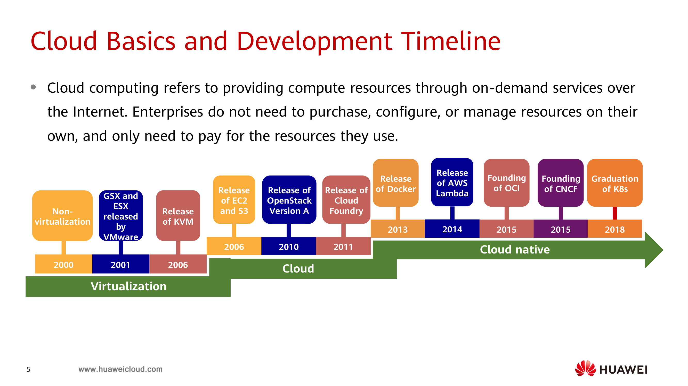

Línea de tiempo (resumen): virtualización con VMware ESX (2001) → release de
EC2 y S3 de AWS (2006) → KVM (2006) → OpenStack (2010) → Cloud Foundry
(2011) → Docker (2013) → AWS Lambda (2014) → CNCF y Kubernetes (2015) →
Open Container Initiative — OCI (2015) → graduación de Kubernetes en CNCF
(2018).

#### Modelos de despliegue de la nube

| Modelo | Descripción |
|---|---|
| **Private cloud** (nube privada) | Infraestructura propiedad y de uso exclusivo de una sola organización. |
| **Public cloud** (nube pública) | El proveedor del servicio cloud es dueño y opera la infraestructura, ofreciéndola al público o a empresas clientes. |
| **Hybrid cloud** (nube híbrida) | Combinación de nube pública y privada, vista externamente como una sola nube. |

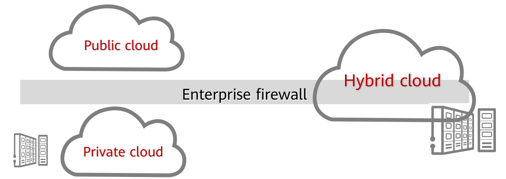

#### Modelos de servicio del cloud computing

Existen tres modelos de servicio:

- **IaaS** (Infrastructure as a Service): provee servicios de cómputo y
  almacenamiento.
- **PaaS** (Platform as a Service): provee entornos para desarrollar y
  desplegar aplicaciones en la nube.
- **SaaS** (Software as a Service): provee aplicaciones como servicio.

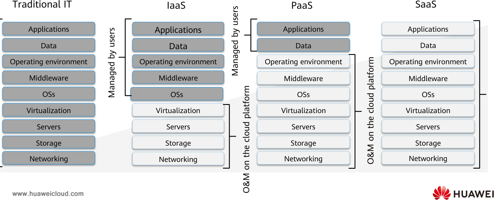

En cada capa (Applications, Data, Operating environment, Middleware, OSs,
Virtualization, Servers, Storage, Networking) se ve cómo, a medida que se
avanza de IT tradicional a SaaS, más capas pasan de estar "managed by users"
(administradas por el usuario) a estar bajo **O&M** (Operations &
Maintenance / operación y mantenimiento) del proveedor de la nube.

#### Beneficios del cloud computing

- **Reducción de la inversión inicial en activos fijos**: gracias a las
  economías de escala de Huawei Cloud, los recursos se obtienen en minutos
  y no requieren grandes inversiones de capital.
- **Adquisición de recursos rápida y a gran escala**: se puede asumir que
  los recursos siempre están disponibles, lo que facilita ajustes
  dinámicos del servicio.
- **No hay que adivinar la capacidad necesaria**: al obtenerse recursos
  rápidamente, no es necesario sobre-dimensionar de antemano.
- **O&M más simple**: más automatizado y a nivel de aplicación, menos
  manual y a nivel de infraestructura.
- **Servicios ágiles y en múltiples ubicaciones geográficas**: acceso
  estandarizado vía API, sentando las bases para ser "cloud native" y la
  innovación de negocio.
- **Foco en el valor del negocio**: se evita trabajo repetido de
  infraestructura para poder enfocarse en el core del negocio.

---

### 2. Infraestructura de Huawei Cloud

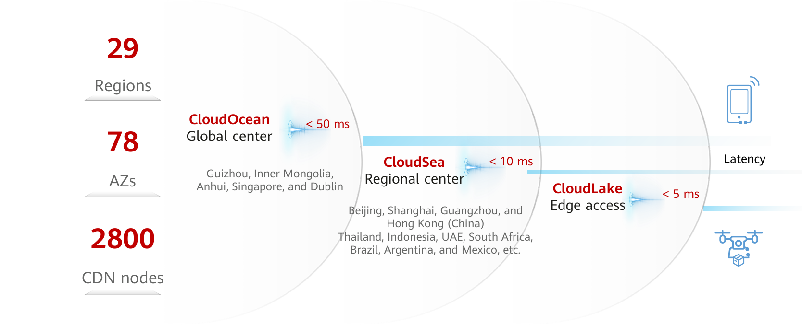

Huawei Cloud cuenta con 29 **Regions** (regiones), 78 **AZs**
(Availability Zones / zonas de disponibilidad) y 2800 nodos **CDN**
(Content Delivery Network / red de distribución de contenido), con latencias
diferenciadas según el tipo de nodo (CloudOcean < 50 ms, CloudSea < 10 ms,
CloudLake < 5 ms).

- **Region** (región): conjunto de recursos agrupados por ubicación
  geográfica. Cada región tiene una o más AZs y está completamente aislada
  de las demás regiones. Las AZs de una misma región se comunican entre sí
  por red privada; las de regiones distintas, no.
- **Availability Zone / AZ** (zona de disponibilidad): área geográfica con
  suministro eléctrico y redes independientes dentro de la misma región.
  Generalmente es una sala de equipos física independiente. Si una AZ
  falla, las demás AZs de la misma región siguen funcionando.

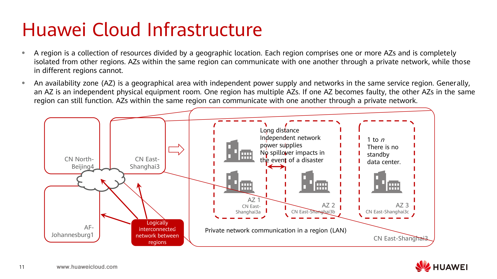

#### ¿Cómo elegir una Region?

1. El cumplimiento normativo (**compliance**) es obligatorio.
2. La experiencia de usuario es prioritaria (latencia según cercanía).
3. Algunas funciones son específicas de cada región.
4. El ahorro de costos puede ser mayor en ciertas regiones.

#### ¿Cómo elegir una AZ?

Las AZs existen para mejorar la disponibilidad y permitir aplicaciones
**active-active** (activo-activo) o multi-activo; las AZs son equivalentes
entre sí. El requisito de la aplicación determina la elección:

- **Sin requisito especial**: una AZ es suficiente.
- **Si se requiere alta disponibilidad (HA, High Availability)**: elegir al
  menos dos AZs (una AZ adicional no incrementa el costo).
- **Con más de tres AZs**: la mejora en disponibilidad es marginal y la
  complejidad aumenta.

---

### 3. Principales fuerzas que impulsan la migración a la nube

| Fuerza impulsora | Descripción |
|---|---|
| **Technology-driven** (impulsada por la tecnología) | La migración a la nube es clave para lograr desarrollo ágil de servicios, procesar grandes volúmenes de datos y construir sistemas de TI más resilientes. |
| **Service-driven** (impulsada por el servicio) | Los proveedores cloud ofrecen numerosos servicios PaaS/SaaS y soluciones completas que ayudan a explorar nuevas necesidades de negocio (ej. Huawei Cloud Healthcare Intelligent Twins para farmacéuticas). |
| **Policy-driven** (impulsada por políticas públicas) | El cloud computing es una industria clave, y muchos gobiernos promueven y apoyan la migración a la nube (ej. planes de China, Europa y EE.UU.). |

**Technology-driven** en detalle — evolución típica de la infraestructura
de una empresa:

- **Fase histórica (IT tradicional)**: silos de virtualización, gestión
  manual, desarrollo y despliegue tradicional por parte de proveedores.
- **Fase 1 — Resource integration** (integración de recursos):
  pooling de recursos, virtualización unificada de servidores físicos
  (PM) y virtuales (VM), gestión unificada de recursos.
- **Fase 2 — Agile service** (servicio ágil): infraestructura como
  servicio (compute, storage, networking, container), data lake
  inteligente con big data e IA, desarrollo ágil con DevOps,
  microservicios y contenedores.

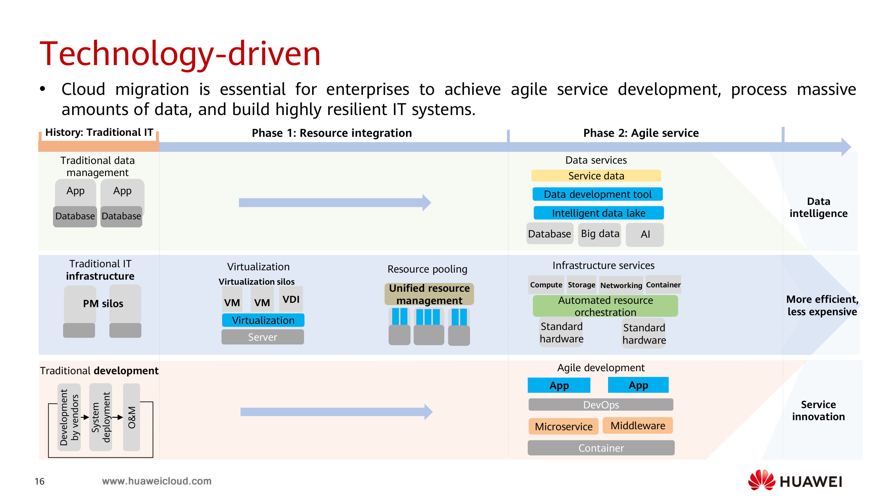

**Policy-driven** — ejemplos de políticas nacionales que promueven la nube:
13th Five-Year Science and Technology Innovation Plan (China, 2016),
Federal Cloud Computing Strategy (EE.UU., 2019), Shaping Europe's Digital
Future (Europa, 2020), 14th Five-Year Plan (China, 2021).

---

### 4. Principios de diseño de arquitectura de servicios en la nube

La arquitectura cloud empresarial debe cumplir con alta confiabilidad, alta
seguridad, consistencia y cumplimiento normativo, siendo a la vez flexible,
rápida y escalable para la innovación de TI.

#### Las cinco dimensiones clave

1. **Performance** (rendimiento): aplicaciones de alto rendimiento y
   análisis rápido para obtener información.
2. **Cost** (costo): optimizar la operación de O&M y reducir mano de obra
   para liberar recursos hacia la innovación.
3. **Security** (seguridad): protección integral de datacenters, accesos,
   redes, almacenamiento y datos.
4. **Availability** (disponibilidad): ante un desastre en un datacenter,
   otro debe poder operar en tiempo real para asegurar continuidad.
5. **Maintainability** (mantenibilidad): recuperación o conmutación a
   tiempo ante fallas o riesgos para asegurar continuidad del servicio.

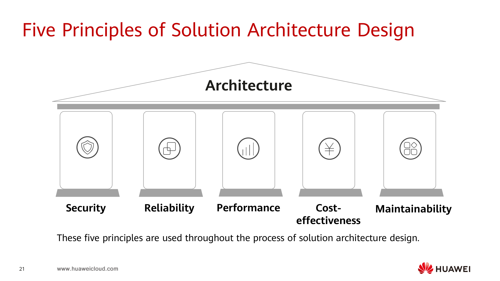

Estos cinco principios (también llamados **Security, Reliability,
Performance, Cost effectiveness, Maintainability**) se aplican durante todo
el proceso de diseño de la arquitectura de la solución.

#### 4.1 Security (seguridad)

Requisitos clave de seguridad en la nube:

- Confidencialidad de datos
- Continuidad de servicios (prevención de brechas externas)
- Políticas de seguridad e identificación/gestión de riesgos
- Prevención de ataques de red e intrusiones
- Cumplimiento legal, auditoría y trazabilidad
- Invisibilidad ante empleados internos no autorizados y ante el propio
  proveedor del servicio cloud

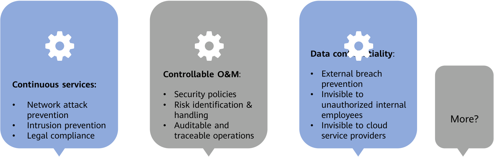

Principios de diseño de seguridad del sistema en la nube:

1. Definir los objetivos de seguridad en base a estándares de
   cumplimiento del sistema (la mejor solución es la que se ajusta al
   cliente, no la que más capas de seguridad agrega).
2. Planificar la seguridad del sistema de forma sistemática (efecto
   "balde": la capacidad de seguridad depende del "tablón más corto").
3. Implementar seguridad en todas las capas, analizando capa por capa
   según los requisitos del cliente.
4. Evaluar riesgos y preparar planes de contingencia para cada punto
   débil identificado.

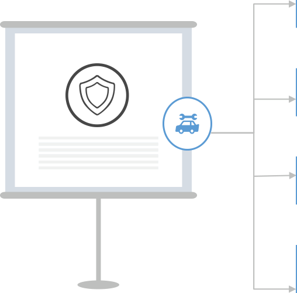

#### 4.2 Reliability / Availability (confiabilidad / disponibilidad)

La disponibilidad de un sistema combina **reliability** (confiabilidad:
continuidad del servicio) y **maintainability** (mantenibilidad:
restauración rápida del servicio):

```
Availability = MTBF / (MTBF + MTTR)
```

- **MTBF** (Mean Time Between Failures / tiempo medio entre fallas)
- **MTTR** (Mean Time To Recover / tiempo medio de recuperación)

Se expresa en "nueves" (ej. 99.995% de disponibilidad equivale a un
servicio accesible durante 100.000 minutos consecutivos —unos 69 días—,
con no más de 5 minutos de indisponibilidad en ese período).

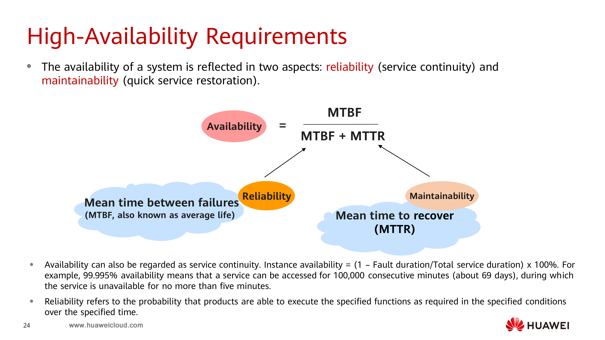

Principios de diseño de alta confiabilidad (HA, High Availability):

- **HA de la capa de aplicación de servicio**: reintentos, aislamiento de
  fallas y degradación elegante (**graceful failure**).
- **HA del diseño de arquitectura del sistema**: eliminación de nodo
  único, clústeres HA, **DR** (Disaster Recovery / recuperación ante
  desastres) cruzando AZs y regiones, backup de datos, seguridad cloud y
  O&M estándar.
- **HA de los servicios cloud**: definir métricas de confiabilidad según
  el negocio, eliminar fallas por diseño, evitar puntos únicos de falla,
  diseñar arquitecturas débilmente acopladas (**loosely coupled**) y
  anticipar contingencias.

#### 4.3 Performance (rendimiento)

Métricas clave de rendimiento en la nube:

- **Latency** (latencia): tiempo en iniciar una operación; la métrica más
  intuitiva del rendimiento cloud.
- **Throughput** (rendimiento de procesamiento): velocidad de
  procesamiento de datos (bytes/s o bits/s); su límite es un cuello de
  botella común.
- **IOPS** (Input/Output Operations Per Second): operaciones de
  entrada/salida por segundo.
- **Concurrency** (concurrencia): capacidad de ejecutar varios procesos
  simultáneamente.

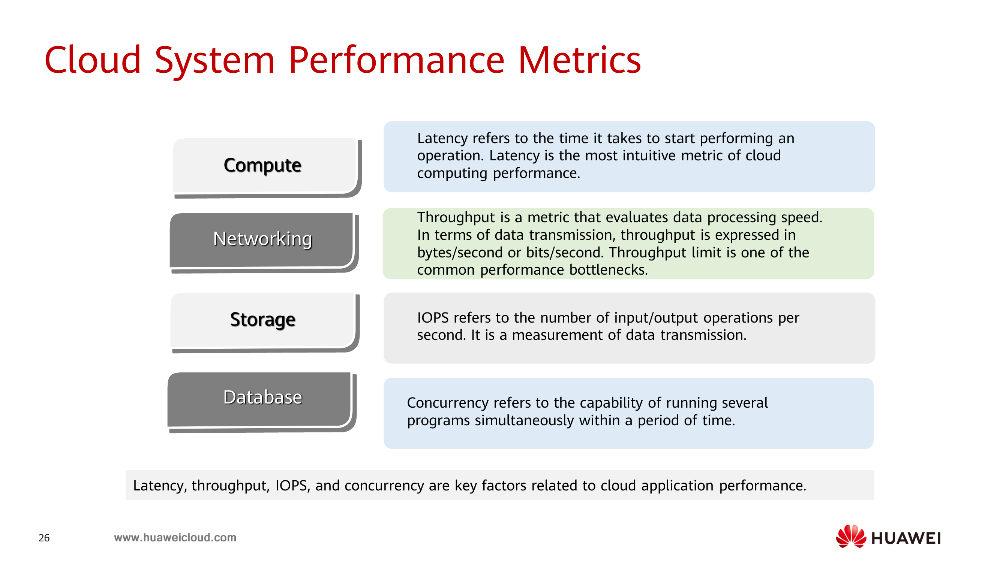

Principios de diseño de rendimiento:

1. Definir métricas según los requisitos del servicio (no agregar
   parámetros de sistema sin necesidad).
2. Comprender y elegir adecuadamente tecnologías avanzadas (pueden traer
   nuevos riesgos).
3. Buscar las características y popularidad de los datos para diseñar
   estrategias de **cache** (caché) apropiadas.
4. Lograr elasticidad del sistema mediante clústeres y características
   cloud.

> El rendimiento no necesita ser extremo: basta con estar levemente por
> encima del estándar requerido.

#### 4.4 Cost (optimización de costos)

1. Reducción continua de costos: asignar costos según el uso real de
   recursos a través del tiempo.
2. Uso de servicios cloud administrados (**cloud hosting services**):
   pagar solo por lo que se usa.
3. Equilibrar oferta y demanda evitando sobreaprovisionamiento.
4. Fomentar conciencia del gasto, rastreando costos por área/producto.
5. Usar recursos costo-efectivos y especificaciones adecuadas.
6. Optimizar costos en múltiples niveles.

#### 4.5 Maintainability (mantenibilidad)

1. Monitorear el estado del sistema de forma integral (base de un O&M
   eficiente).
2. Reducir riesgos manuales mediante automatización.
3. Privilegiar actualizar o reemplazar antes que reparar (restaurar el
   servicio primero, diagnosticar después).
4. Enfocarse en las aplicaciones, no en la infraestructura.

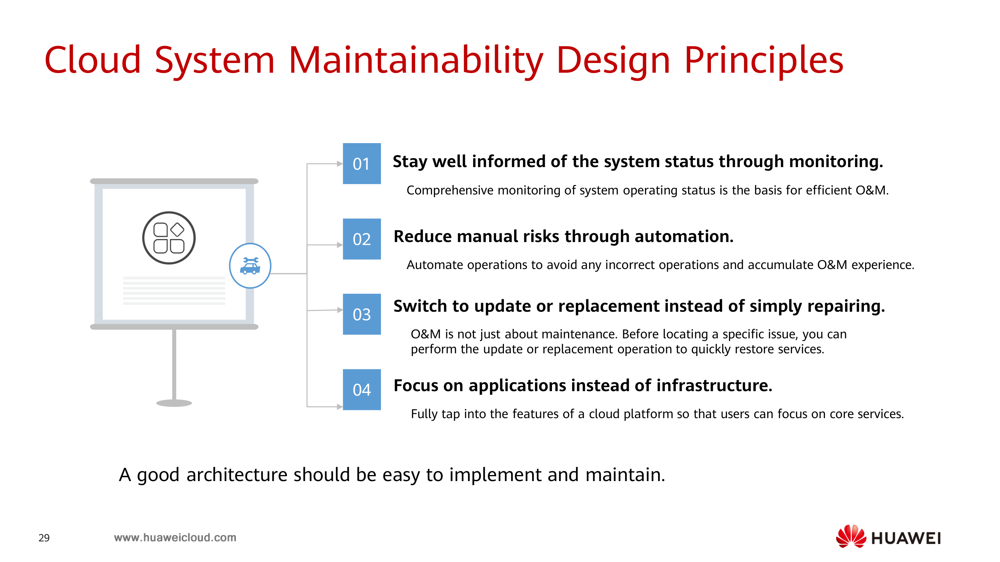

> Una buena arquitectura debe ser fácil de implementar y de mantener.

Estos principios de diseño se aplican tanto en la etapa de **diseño de
arquitectura** como en la de **aceptación de arquitectura**, para resolver
los problemas pendientes.

---

### 5. Requisitos de escenarios típicos en la nube — Caso Vmall

**Vmall** es la plataforma de e-commerce operada por Huawei (ventas de
dispositivos, promociones y lanzamientos de productos), soportada por
servicios de Huawei Cloud.

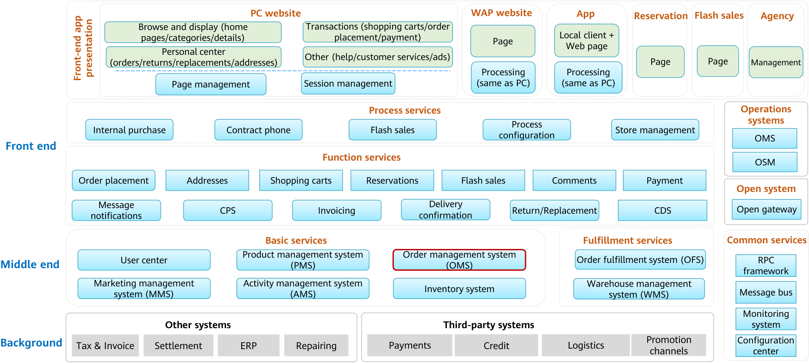

Estructura de capas de Vmall:

- **Front end** (frontend): presentación (sitio PC, WAP, App), procesos
  de venta (carritos, pagos) y servicios de función (direcciones,
  reservas, comentarios).
- **Middle end** (capa media): servicios básicos (centro de usuario,
  gestión de productos y de órdenes) y servicios de cumplimiento
  (**fulfillment**: order fulfillment system — OFS, gestión de
  inventario y almacenes).
- **Backend**: sistemas propios y de terceros (ERP, pagos, logística,
  facturación), integrados vía **open gateway** (gateway abierto).
- **Comunicación**: framework **RPC** (Remote Procedure Call / llamada a
  procedimiento remoto) para comunicación síncrona entre aplicaciones, y
  **message bus** (bus de mensajes) para mensajería asíncrona,
  priorizando rendimiento y confiabilidad.

#### Escenario: Holiday Promotion & New Product Release

Picos de tráfico de 5 a 10 veces el volumen normal (hasta 100x en ciertos
casos):

- **Performance**: compra concurrente de millones de usuarios, cientos de
  miles de órdenes por segundo, decenas de miles de transacciones de pago
  por segundo.
- **Security & reliability**: defensa ante **DDoS** (Distributed Denial of
  Service / ataque de denegación de servicio distribuido) masivo y
  prevención de bots compradores (**scalper bots**).
- **User experience**: acceso fluido 24/7 sin congelamientos en momentos
  clave.

#### Estrategias de diseño para Flash Sale (venta flash)

1. Aislamiento de presión entre el sistema de flash sale y el sitio
   principal.
2. Aislamiento por área (zonas con y sin posible "daño"/sobrecarga).
3. Desacople de servicios entre regiones (split de despliegue y ruteo de
   aplicaciones).
4. Desacople vertical de servicios en varios centros.
5. Soporte distribuido y middleware para todos los recursos (cómputo y
   storage).
6. Expansión lineal con almacenamiento distribuido de órdenes y usuarios.
7. Diseño de base de datos: split vertical (según relación con el
   usuario) y horizontal (sharding de bases grandes).
8. Mejora de rendimiento: separación de lectura/escritura, aceleración
   CDN y caching.
9. Defensa de ataques y control de tráfico: límite de tráfico en **SLB**
   y defensa Nginx.
10. Control de riesgo: identificación de scalpers según reglas.
11. Soporte de actividad: modo de doble orden que desacopla la venta
    flash del sitio principal.

#### Arquitectura de e-commerce en la nube

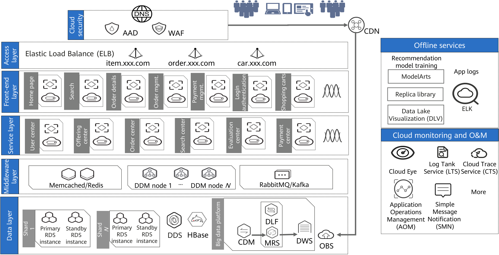

Componentes principales (de afuera hacia adentro):

- **Borde**: AAD (Anti-DDoS), **WAF** (Web Application Firewall), **CDN**.
- **Acceso**: **ELB** (Elastic Load Balance / balanceo de carga elástico).
- **Capa de servicio**: centros de usuario, oferta, órdenes, búsqueda,
  evaluación y pago.
- **Middleware**: sharding (1...N), Memcached/Redis, **DDM** (Distributed
  Database Middleware), RabbitMQ/Kafka.
- **Datos**: instancias RDS (primaria/standby), DDS, HBase, MRS, DWS, OBS,
  big data platform.
- **Monitoreo y O&M cloud**: Cloud Eye, Log Tank Service (LTS), Cloud
  Trace Service (CTS), AOM, SMN.
- **IA**: ModelArts para entrenamiento de modelos de recomendación.

#### Tarea interactiva: diseño del Order Center

> ¿Cómo diseñarías una buena arquitectura cloud para desplegar los
> servicios del centro de órdenes (**order center**)?

Arquitectura de referencia (multi-AZ dentro de una región):

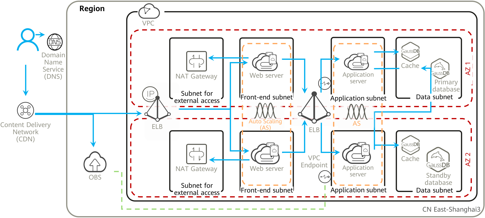

- Una **Region** con dos **AZs**, cada una con subredes separadas:
  acceso externo, frontend, aplicación y datos.
- **CDN** + DNS + **VPC Endpoint** hacia cada AZ.
- En cada AZ: **NAT Gateway**, **ELB** + **Auto Scaling (AS)** para los
  web servers y application servers, caché, y una base de datos
  (primaria en AZ 1, standby en AZ 2).
- **OBS** (Object Storage Service) compartido entre AZs.

---

### Quiz del módulo

**¿En cuáles de los siguientes aspectos se puede evaluar y optimizar un
sistema una vez desplegado en Huawei Cloud?**
A. Reliability — B. Performance — C. Security — D. Maintainability

*(Respuesta: las cuatro — junto con Cost, son las cinco dimensiones de
diseño de arquitectura vistas en la sección 4.)*

### Acrónimos y abreviaturas

- **ECS**: Elastic Cloud Server
- **EVS**: Elastic Volume Service

---

### Resumen del módulo

- Cloud computing evolucionó de la virtualización (2000s) al cloud
  native (Kubernetes, 2018); existen tres modelos de despliegue
  (private/public/hybrid) y tres de servicio (IaaS/PaaS/SaaS).
- Huawei Cloud organiza su infraestructura en **Regions** (aisladas entre
  sí) y **AZs** (para alta disponibilidad); se recomiendan 2+ AZs cuando
  se requiere HA.
- La migración a la nube está impulsada por tecnología, por la oferta de
  servicios PaaS/SaaS de los proveedores, y por políticas públicas.
- Toda arquitectura de solución se diseña y evalúa según **cinco
  principios**: Security, Reliability/Availability, Performance, Cost,
  Maintainability.
- El caso Vmall ilustra cómo aplicar estos principios a un e-commerce
  real, con foco en escenarios de tráfico extremo (flash sale).

### Mapa conceptual

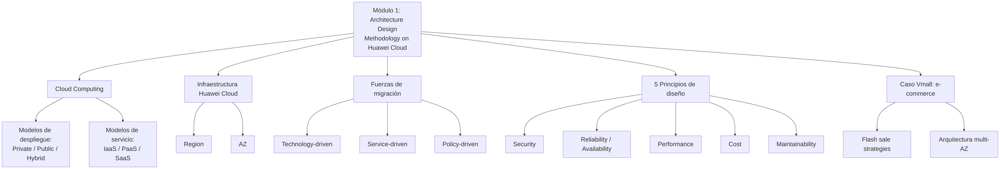
```mermaid
%%{init: {"themeVariables": {"fontSize": "24px"}, "flowchart": {"useMaxWidth": false, "nodeSpacing": 75, "rankSpacing": 75}}}%%
flowchart TD
    M1["Módulo 1: Architecture Design<br/>Methodology on Huawei Cloud"]
    M1 --> A[Cloud Computing]
    A --> A1["Modelos de despliegue:<br/>Private / Public / Hybrid"]
    A --> A2["Modelos de servicio:<br/>IaaS / PaaS / SaaS"]
    M1 --> B[Infraestructura Huawei Cloud]
    B --> B1[Region]
    B --> B2[AZ]
    M1 --> C[Fuerzas de migración]
    C --> C1[Technology-driven]
    C --> C2[Service-driven]
    C --> C3[Policy-driven]
    M1 --> D["5 Principios de diseño"]
    D --> D1[Security]
    D --> D2["Reliability / Availability"]
    D --> D3[Performance]
    D --> D4[Cost]
    D --> D5[Maintainability]
    M1 --> E["Caso Vmall: e-commerce"]
    E --> E1["Flash sale strategies"]
    E --> E2["Arquitectura multi-AZ"]
```

---

### Notas y capturas propias

Espacio para agregar capturas propias del módulo. Guardar las imágenes en
`screenshots/01-architecture-design-methodology-on-huawei-cloud/` y
referenciarlas acá, por ejemplo:

```markdown

```

---

## Módulo 2 — Typical Service Implementation Solutions on the Cloud

> Fuente: `pdfs/2. Typical Service Implementation Solutions on the Cloud.pdf` ·
> Extracción cruda: `raw/02-typical-service-implementation-solutions-on-the-cloud/module.md`

### Objetivos del módulo

Al finalizar esta lección se debe poder describir:

- Arquitecturas de aplicación comunes (**common application
  architectures**)
- Servicios de infraestructura de Huawei Cloud
- Estrategias de evolución de la arquitectura de **HA** (High Availability
  / alta disponibilidad) en Huawei Cloud

Contenidos del módulo:

1. Construcción de un sistema de servicio típico en la nube
2. Discusión sobre el diseño de arquitectura HA en la nube

> Una **application instance** (instancia de aplicación) es la unidad
> mínima para desplegar servicios en la nube. Esta lección describe cómo
> desplegar instancias de aplicación en Huawei Cloud, qué recursos de
> Huawei Cloud usar, y cuáles son las estrategias de optimización y
> evolución para sistemas de servicio desplegados en Huawei Cloud.

---

### 1. Construcción de un sistema de servicio típico en la nube

#### 1.1 Aplicación, negocio y arquitecturas de capas

**Application** (aplicación): conjunto lógico de una o más funciones
independientes y completas, estrechamente relacionadas entre sí, con
características de negocio específicas. Los servicios de aplicación
proveen capacidades a sistemas externos a través de APIs reutilizables.

**Business** (negocio): la forma en que se presentan los valores de las
capacidades de negocio. Los servicios de negocio son bienes o servicios
provistos por empresas u organizaciones a través de APIs explícitas, y son
gestionados explícitamente por dichas organizaciones.

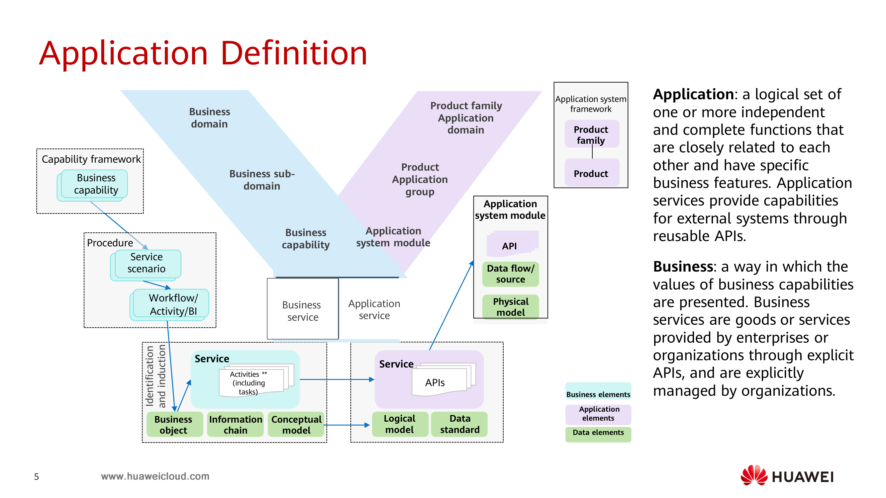

##### Aplicaciones e instancias de aplicación

Una **application** (aplicación) es la unidad mínima de software que puede
completar de forma independiente un proceso de servicio para un cliente.
Debe tener dos elementos:

- **Un único vendor** (proveedor): responsable de los cambios de código de
  la aplicación.
- **Un único owner** (propietario): del lado del cliente, responsable del
  ciclo de vida de la aplicación (upgrade, actualización, reemplazo,
  eliminación), con derecho a decidir cuándo migrarla (**cutover**) y
  responsable de su aceptación.

Una aplicación consiste en un conjunto de sistemas de software, con un
único vendor y owner, sin atributos específicos de entorno operativo. Una
**application instance** (instancia de aplicación) es un entorno operativo
independiente para una aplicación, con atributos específicos (cuenta y
contraseña, dirección de acceso, variables de entorno).

- Relación aplicación : instancias = **1:N**
- Unidad mínima de migración a la nube (**cloud migration**): la
  application instance

##### Capas de la aplicación: arquitectura típica de tres capas

Una arquitectura típica de tres capas consiste, de arriba hacia abajo, en:

- **User interface layer / UIL** (capa de interfaz de usuario, o capa
  web)
- **Business logic layer / BLL** (capa de lógica de negocio, también
  llamada capa de dominio o de servicio): procesa la lógica de servicio
  del sistema.
- **Data access layer / DAL** (capa de acceso a datos): se comunica
  directamente con la base de datos (alta, baja, modificación, consulta).
  También se llama patrón **DAO** (Data Access Object).

##### Capas de la aplicación: arquitectura de cuatro capas

La arquitectura de tres capas es simple de implementar, pero propensa a
"inflarse" (**bloat**) porque la lógica de negocio se concentra en la capa
de servicio. La arquitectura de cuatro capas agrega una capa general de
procesamiento (**manager layer**) a las tres capas originales:

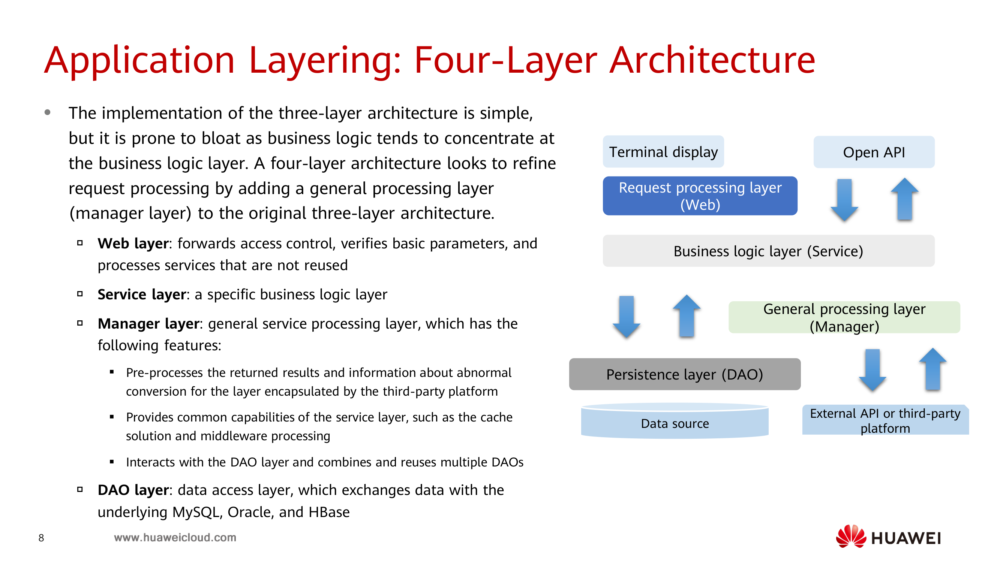

- **Web layer**: redirige el control de acceso, valida parámetros básicos
  y procesa servicios que no se reutilizan.
- **Service layer**: capa específica de lógica de negocio.
- **Manager layer** (capa de procesamiento general):
  - Pre-procesa resultados devueltos e información de conversión de
    excepciones de la capa encapsulada por plataformas de terceros.
  - Provee capacidades comunes de la capa de servicio, como la solución
    de caché y el procesamiento de middleware.
  - Interactúa con la capa DAO, combinando y reutilizando varios DAOs.
- **DAO layer** (capa de acceso a datos): intercambia datos con MySQL,
  Oracle o HBase subyacentes.

##### Capas de la aplicación: arquitectura MVC

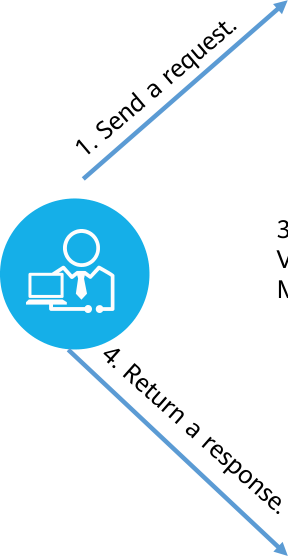

**MVC** (Model-View-Controller) es un patrón arquitectónico que separa una
aplicación en tres componentes lógicos principales. Agrupa la lógica de
negocio en un componente, evitando reescribirla al mejorar o personalizar
interfaces e interacción con el usuario.

- **View** (vista): provee una **GUI** para la interacción del usuario.
- **Model** (modelo): transporta datos y procesa solicitudes del usuario
  (lógica de datos de la aplicación, ej. acceso a bases de datos).
- **Controller** (controlador): redirige la solicitud del usuario al
  Model correspondiente, procesa el resultado del cálculo y responde al
  usuario.

##### Capas de la aplicación: arquitectura de microservicios

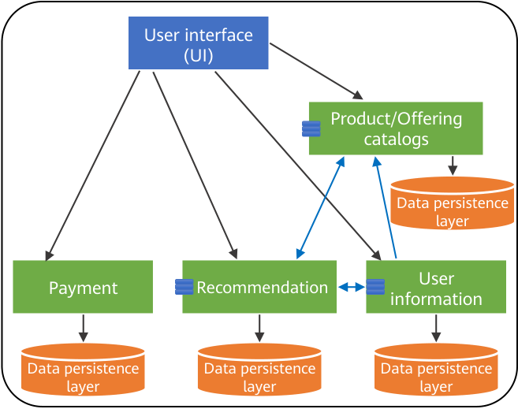

- La **microservice architecture** (arquitectura de microservicios)
  descompone las aplicaciones en un grupo de servicios pequeños
  (microservicios) que cooperan para brindar capacidades de negocio.
- Cada microservicio es diseñado, desarrollado y probado por un equipo
  independiente, y puede desplegarse por separado en producción.
- Cada microservicio tiene funciones específicas; se seleccionan
  microservicios concretos para implementar funciones específicas de una
  aplicación.

#### 1.2 Arquitectura de referencia: plataforma de e-commerce

> Ejercicio del curso: si quisieras desplegar una plataforma de e-commerce
> en Huawei Cloud, ¿cómo diseñarías la arquitectura de tres capas?

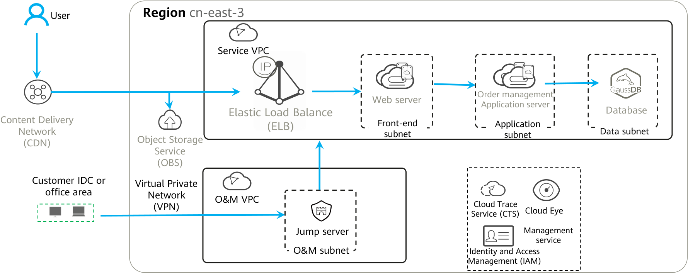

La arquitectura de referencia usa una **Region** (`cn-east-3`) con dos
**VPC** (Virtual Private Cloud):

- **Service VPC**: con subred de frontend (web server detrás de **ELB** y
  **CDN**), subred de aplicación (application server, gestión de
  órdenes) y subred de datos (database). **OBS** (Object Storage Service)
  para almacenamiento de objetos.
- **O&M VPC**: jump server conectado vía **VPN** (Virtual Private
  Network) hacia el IDC o área de oficina del cliente, con **CTS** (Cloud
  Trace Service), **Cloud Eye** (monitoreo) e **IAM** (Identity and
  Access Management) como servicios de gestión.

##### Lista de servicios

| Servicio | Descripción |
|---|---|
| **ECS** | Elastic Cloud Server: componente básico de cómputo (vCPUs, memoria, OS y discos **EVS**). Se usa como una computadora o servidor físico local. |
| **VPC** | Virtual Private Cloud: redes virtuales lógicamente aisladas y privadas para recursos cloud. Permite personalizar subredes, security groups, network ACLs, asignar **EIP** y ancho de banda. Con Direct Connect o VPN se conecta a un datacenter on-premises. |
| **Security Group** (grupo de seguridad) | Conjunto de reglas de control de acceso para recursos cloud con los mismos requisitos de seguridad y confianza mutua. |
| **Subnet** (subred) | Bloque **CIDR** único con un rango de IPs dentro de una VPC. Todos los recursos de una VPC deben desplegarse en subredes. |
| **Network ACL** | Capa de seguridad opcional para subredes; controla el tráfico de entrada y salida una vez asociada. |
| **EIP** | Elastic IP: dirección IP pública independiente y ancho de banda para acceso a Internet. Se puede vincular a un ECS, BMS, IP virtual, balanceador de carga o gateway NAT. |
| **RDS** | Relational Database Service: servicio de base de datos en la nube, confiable, escalable y fácil de administrar. |
| **OBS** | Object Storage Service: almacenamiento optimizado para grandes volúmenes de datos, ilimitado, seguro y de bajo costo. |
| **CTS** | Cloud Trace Service: registra operaciones sobre los recursos cloud de la cuenta; permite análisis de seguridad, trazabilidad de cambios, auditoría de cumplimiento y localización de fallas. |
| **CES (Cloud Eye)** | Plataforma de monitoreo multidimensional (ECS, ancho de banda); permite configurar reglas de alarma e identificar excepciones de recursos. |
| **IAM** | Identity and Access Management: servicio básico de Huawei Cloud que gestiona permisos para controlar de forma segura el acceso a servicios y recursos cloud. |

---

### 2. Discusión sobre el diseño de arquitectura HA en la nube

#### 2.1 Problemas de la arquitectura inicial

La arquitectura anterior implementa las funciones básicas de un sitio web,
pero todavía tiene varios problemas, analizables desde las **cinco
dimensiones** vistas en el Módulo 1: **Architecture, Security,
Reliability, Performance, Cost-effectiveness, Maintainability**.

#### 2.2 Roadmap de optimización: 12 pasos

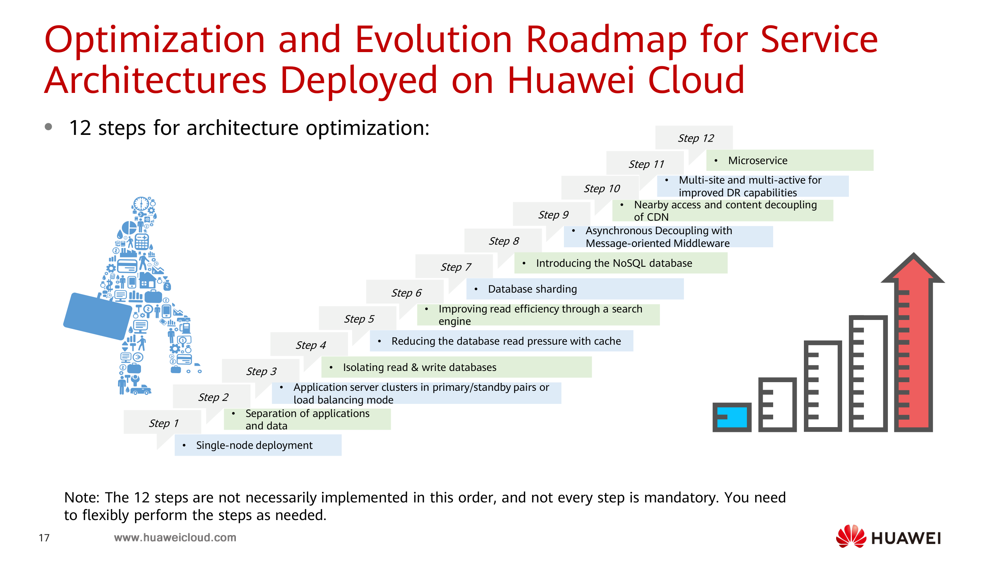

> Nota: los 12 pasos no necesariamente se implementan en este orden, y no
> todos son obligatorios. Se aplican de forma flexible según necesidad.

1. Single-node deployment (despliegue en un solo nodo)
2. Separation of applications and data (separación de aplicaciones y
   datos)
3. Application server clusters en pares primary/standby o en modo load
   balancing
4. Isolating read & write databases (aislamiento de bases de lectura y
   escritura)
5. Reducing database read pressure with cache (caché para reducir la
   presión de lectura)
6. Improving read efficiency through a search engine (motor de búsqueda)
7. Database sharding (partición de bases de datos)
8. Introducing the NoSQL database
9. Asynchronous decoupling with message-oriented middleware (desacople
   asíncrono con middleware de mensajería)
10. Nearby access and content decoupling (acceso cercano y desacople de
    contenido, vía CDN)
11. Multi-site and multi-active for improved DR capabilities
    (multi-sitio y multi-activo para mejorar la capacidad de DR)
12. Microservice (microservicios)

##### Paso 1 — Single-node deployment

En las etapas iniciales del desarrollo de un sitio, todo el software corre
en un único nodo: contenedores **JVM** (Tomcat, Jetty, JBoss), frameworks
como Maven + Spring + Struts + Hibernate, y una base de datos (MySQL, SQL
Server, Oracle) accedida vía **JDBC**, todo instalado en una sola máquina.

- **Servicio de Huawei Cloud**: ECS
- **Desventaja**: contención de recursos entre aplicación y base de
  datos; un sistema de un solo nodo no cumple los requisitos de servicio.

##### Paso 2 — Separation of applications and data

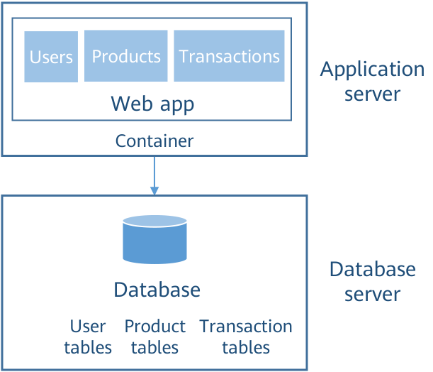

El **database server** se separa del **web server**, mejorando la
capacidad de carga y de **DR** (Disaster Recovery).

- **Servicios de Huawei Cloud**: ECS (aplicaciones) + ECS (BD
  autogestionada) o ECS + RDS
- **Desventaja**: un único servidor de aplicación no soporta el aumento
  de tráfico; pueden ocurrir **SPOF** (Single Points of Failure / puntos
  únicos de falla).

##### Paso 3 — Clusters de application server

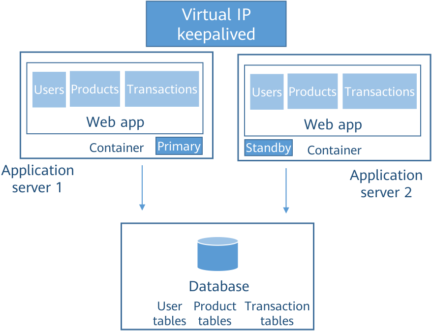

Asumiendo que el servidor de base de datos tiene capacidad suficiente, se
despliegan dos o más application servers en pares **primary/standby**
(primario/en espera) que comparten la misma base de datos. **Keepalived**
gestiona el switchover entre ellos, asociados a la misma IP virtual.

- **Servicios**: ECS + RDS
- **Desventaja**: no hay balanceo de carga entre servidores; solo
  funcionan en pares; el rendimiento de un servidor individual es
  limitado.

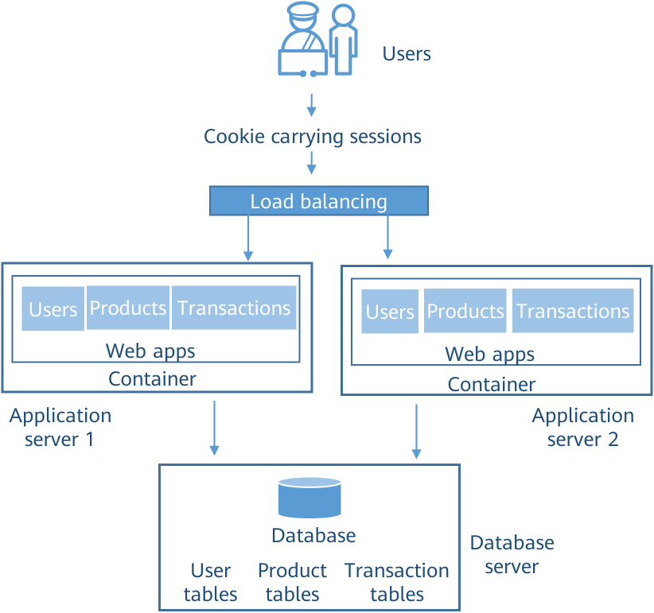

Alternativa: dos o más application servers con **ELB** (Elastic Load
Balance) distribuyendo tráfico según el algoritmo configurado.

- **Servicios**: ECS + RDS + ELB (balanceo de capa 7)
- **Ventaja**: ELB mejora mucho la disponibilidad y escalabilidad.
- **Desventaja**: hay que procesar datos de sesión adicionales; la carga
  de la base de datos sigue siendo alta.

##### Paso 4 — Isolating read & write databases

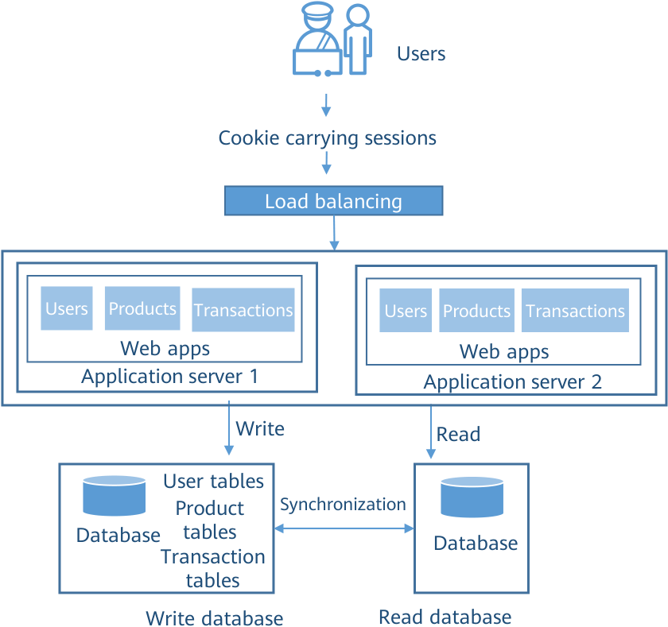

Dividir la base de datos en dos partes sin más genera inconsistencia de
datos. Por eso se usa primero **read/write isolation** (aislamiento
lectura/escritura) con **replicación primary/standby**.

- **Servicios**: ECS + RDS (primary/standby) + ELB
- **Ventaja**: las lecturas se mueven a la base standby, reduciendo la
  presión sobre la primaria.
- **Desventaja**: la aplicación debe elegir la fuente de datos entre
  varias bases standby.

##### Paso 5 — Reducing database read pressure with cache

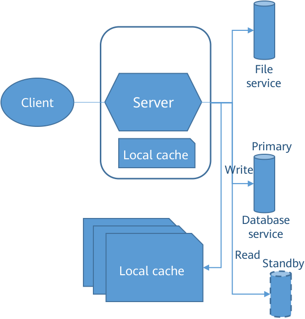

Regla 80/20: una base de datos suele tener poca información que se
actualiza rara vez pero se accede con frecuencia. Una capa de caché reduce
la presión de acceso y acelera las consultas. El local cache es rápido
pero no compartido ni HA; un cache cluster sí ofrece alta disponibilidad,
es compartible y de gran capacidad.

- **Servicios**: ECS + RDS (primary/standby) + ELB + **DCS** (Distributed
  Cache Service)
- **Ventaja**: cachear datos "calientes" en DCS evita leer la base cada
  vez.
- **Desventaja**: búsqueda difusa (**fuzzy keyword search**) ineficiente.

##### Paso 6 — Improving read efficiency through a search engine

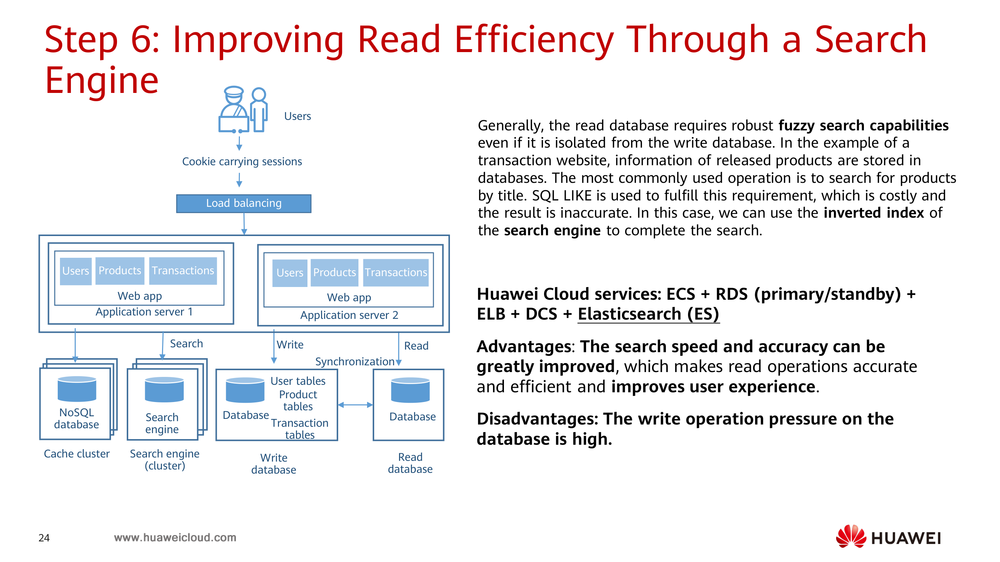

Buscar productos por título con `SQL LIKE` es costoso e impreciso. Se usa
el **inverted index** (índice invertido) de un motor de búsqueda.

- **Servicios**: ECS + RDS (primary/standby) + ELB + DCS +
  **Elasticsearch (ES)**
- **Ventaja**: búsqueda más rápida y precisa, mejor experiencia de
  usuario.
- **Desventaja**: alta presión de escritura sobre la base de datos.

##### Paso 7 — Database sharding (partición de bases de datos)

A medida que crece el volumen de datos aparecen cuellos de botella de
rendimiento. Dos métodos:

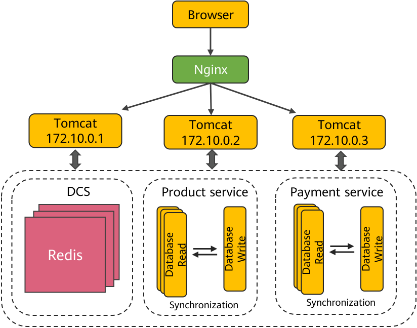

- **Vertical partitioning** (partición vertical): los datos se separan
  por función (transacciones, productos, usuarios) en bases distintas.
  - **Ventaja**: no hay que guardar todo el dato de servicio en la misma
    base; cada servicio se optimiza por separado.
  - **A resolver**: consistencia de estado y sincronización entre bases;
    transacciones cross-service y joins cross-database.

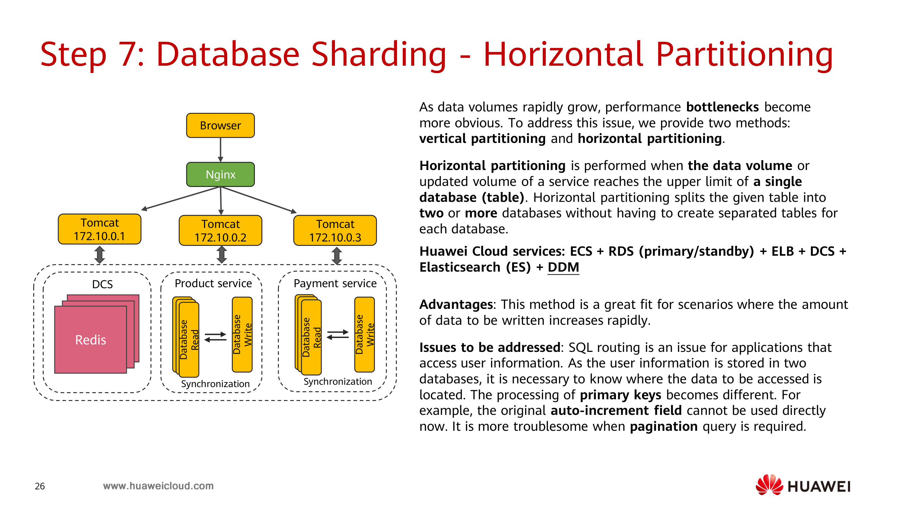

- **Horizontal partitioning** (partición horizontal): se aplica cuando el
  volumen de datos o de actualizaciones alcanza el límite de una sola
  base/tabla; divide una tabla en dos o más bases sin crear tablas
  separadas por base.
  - **Ventaja**: ideal cuando el volumen de escritura crece rápido.
  - **A resolver**: ruteo SQL (saber en qué base está cada dato), manejo
    distinto de **primary keys** (no se puede usar auto-increment
    directo), paginación más compleja.

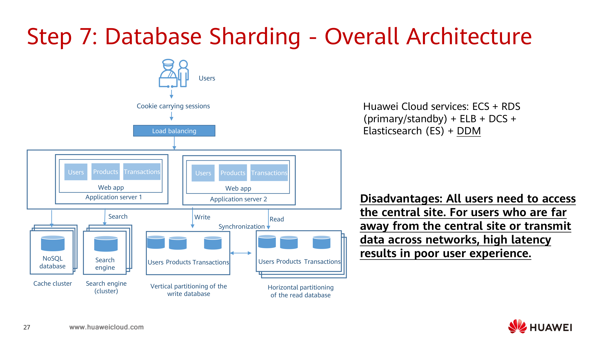

- **Servicios**: ECS + RDS (primary/standby) + ELB + DCS + ES +
  **DDM** (Distributed Database Middleware)
- **Desventaja general**: todos los usuarios acceden al sitio central;
  para usuarios lejanos o con tráfico cross-network, la alta latencia
  empeora la experiencia.

##### Paso 8 — Introducing the NoSQL database

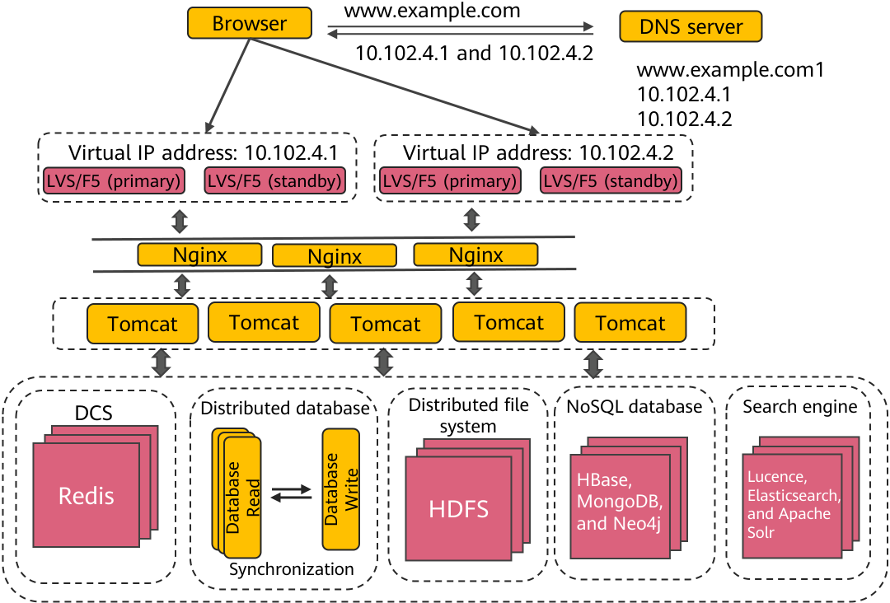

Recolectar estadísticas de reportes puede fallar con demasiados datos;
consultas complejas ralentizan otras consultas. Las bases relacionales no
son ideales para búsqueda full-text ni estructuras de datos variables.
Soluciones según escenario: **MRS HDFS** (archivos masivos), **MRS HBase**
y **Redis** (clave-valor), **OLAP** (análisis multidimensional).

- **Servicios**: **MRS** (MapReduce Service, big data) + **DWS** (Data
  Warehouse Service) + **DDS** (Document Database Service)
- **Ventaja**: arquitectura compatible con el ecosistema de la industria,
  con seguridad, usabilidad y HA mejoradas.
- **A resolver**: se agregan más componentes para cubrir distintos
  requisitos, lo que dificulta el upgrade e iteración del servicio (cada
  aplicación termina con demasiado código de servicio).

##### Paso 9 — Asynchronous decoupling with message-oriented middleware

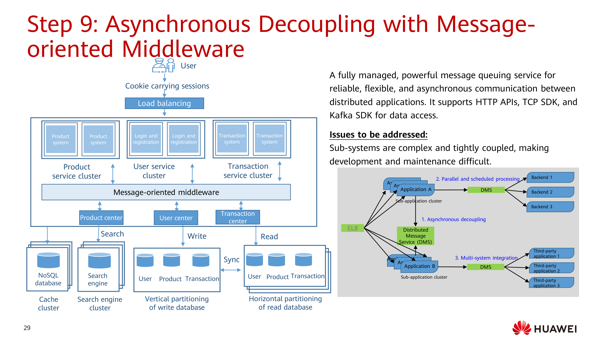

**DMS** (Distributed Message Service): servicio de colas de mensajes
totalmente administrado para comunicación confiable, flexible y asíncrona
entre aplicaciones distribuidas. Soporta APIs HTTP, SDK TCP y SDK Kafka.

- **A resolver antes**: subsistemas complejos y fuertemente acoplados,
  difíciles de desarrollar y mantener.
- **Usos**: 1) desacople asíncrono, 2) procesamiento paralelo y
  programado, 3) integración multi-sistema (con terceros).

##### Paso 10 — Nearby access and content decoupling

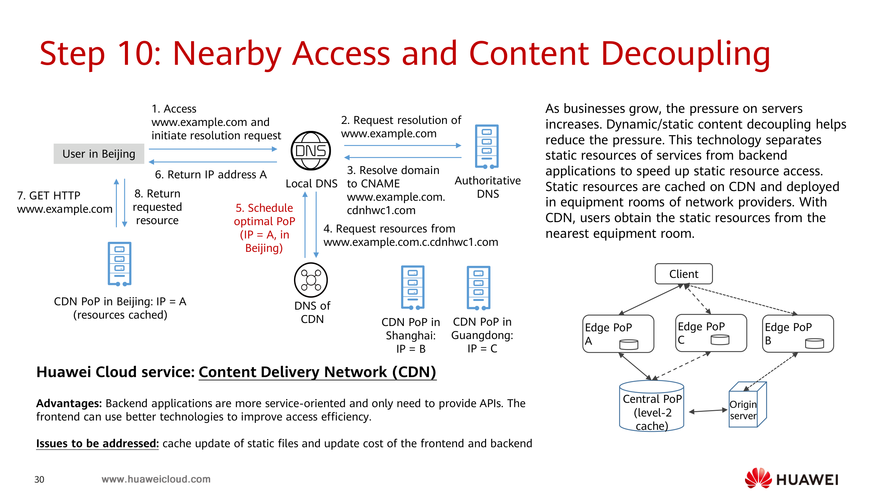

A medida que crece el negocio, aumenta la presión sobre los servidores. El
desacople de contenido dinámico/estático ayuda: los recursos estáticos se
separan del backend, se cachean en **CDN** y se despliegan en salas de
equipos de proveedores de red, para que el usuario los obtenga desde la
sala más cercana.

- **Servicio**: CDN (Content Delivery Network)
- **Ventaja**: el backend se orienta más a servicio (solo expone APIs); el
  frontend puede usar mejores tecnologías para la eficiencia de acceso.
- **A resolver**: actualización de caché de archivos estáticos y costo de
  actualización entre frontend y backend.

##### Paso 11 — Multi-site and multi-active para mejor capacidad de DR

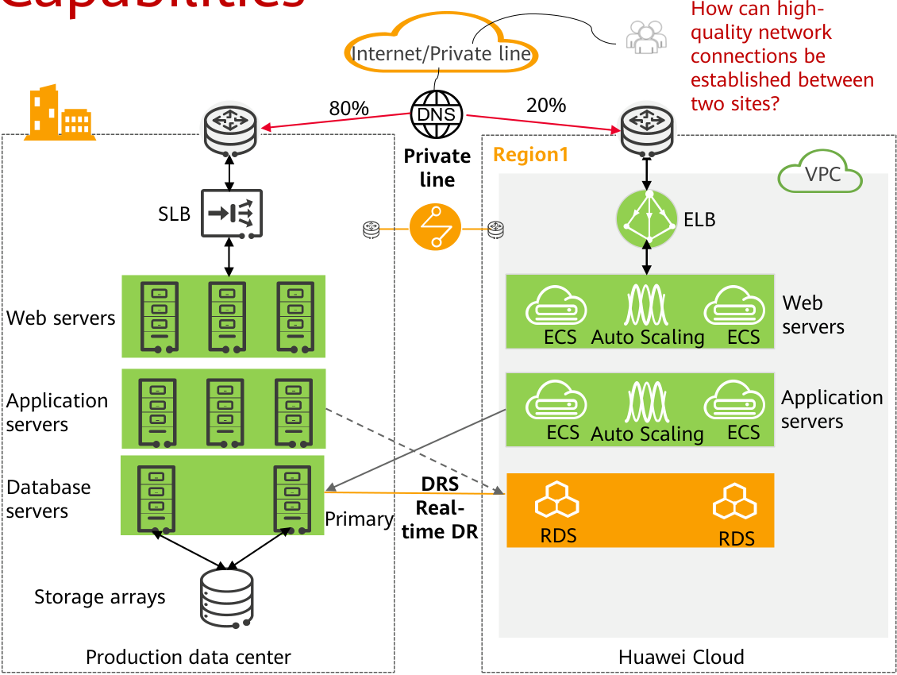

Cuando un sistema de un solo sitio no soporta accesos a gran escala y no
se puede desplegar DR regional, se necesita un sitio de DR para mejorar la
concurrencia, usando DR **active-active** (activo-activo) para mejorar la
disponibilidad.

- **Servicios**: ELB (capa 4 y 7) + **CBR** (Cloud Backup and Recovery) +
  RDS (primary/standby)
- **Terceros**: DNS inteligente, **GSLB**, solución de DR a nivel de
  aplicación
- **Ventaja**: reduce la presión de acceso a un solo sitio y mejora la
  disponibilidad del sistema.
- **Desventaja**: a medida que crecen el volumen de datos y los
  servicios, las bases relacionales solas pueden no cubrir todos los
  requisitos de recuperación y analítica.

##### Paso 12 — Microservice

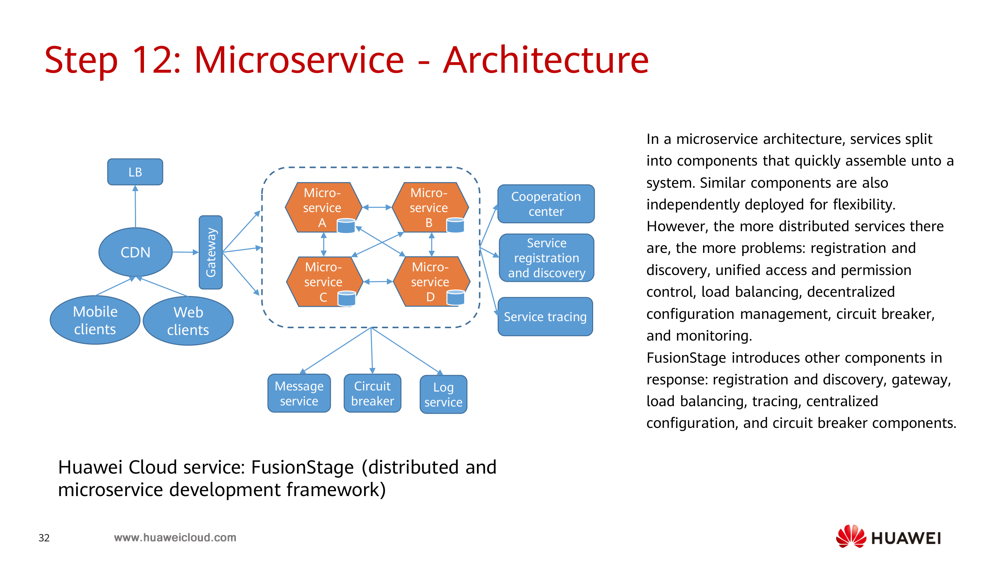

En una arquitectura de microservicios, los servicios se dividen en
componentes que se ensamblan rápidamente en un sistema, desplegados de
forma independiente. Cuantos más servicios distribuidos hay, más
problemas: registro y descubrimiento, control de acceso y permisos
unificado, balanceo de carga, gestión de configuración descentralizada,
**circuit breaker** (cortacircuitos) y monitoreo.

**FusionStage** (framework de desarrollo distribuido y de microservicios
de Huawei) responde con componentes de registro/descubrimiento, gateway,
balanceo de carga, tracing, configuración centralizada y circuit breaker.

**Containerización**:

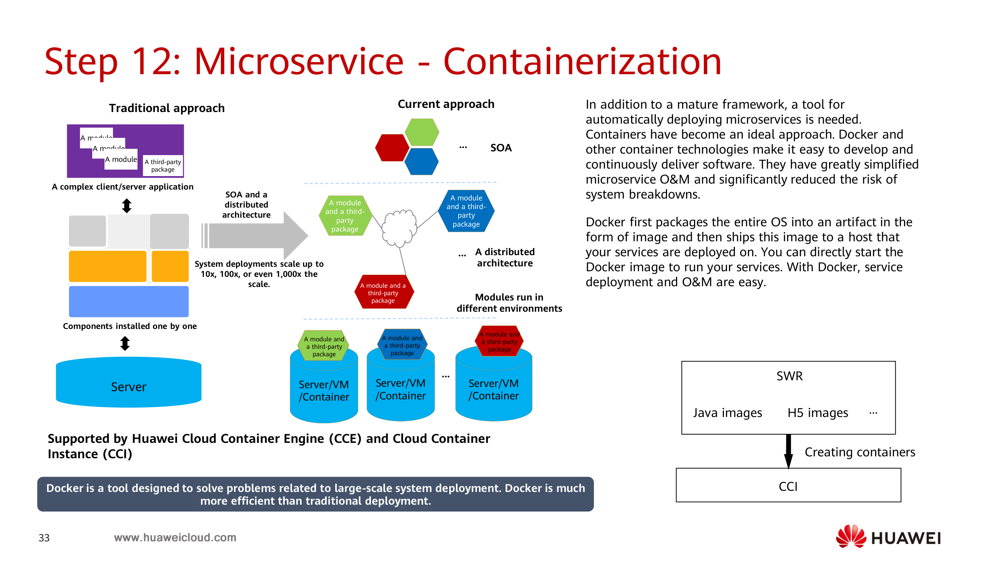

Docker empaqueta todo el sistema operativo en un artefacto (**image**) que
se distribuye a un host, donde se inicia directamente para correr el
servicio. Esto simplifica mucho el despliegue y el O&M de microservicios y
reduce el riesgo de caídas del sistema.

- **Soportado por**: **CCE** (Cloud Container Engine) y **CCI** (Cloud
  Container Instance)

**Service meshes**:

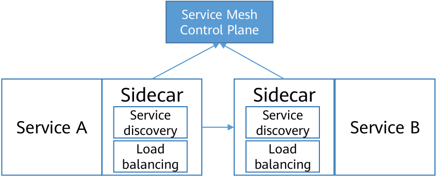

Una arquitectura de microservicios permite iteración rápida y entrega
continua, pero agrega complejidad: además de la lógica de negocio, hay que
invertir en funciones de red (registro, descubrimiento, comunicación,
balanceo de carga, circuit breaking, timeouts). Librerías como Hystrix o
Eureka cubren esto pero son intrusivas. Un **service mesh** resuelve esto
como capa de infraestructura que maneja toda la comunicación entre
proxies, dejando a los desarrolladores enfocarse en la lógica de negocio.

> En Huawei Cloud, **ASM** (Istio-based service mesh) aborda los
> principales desafíos de **ServiceComb** (framework de gobernanza de
> microservicios basado en SDK).

---

### Quiz del módulo

**(Selección múltiple) ¿Cuál de las siguientes afirmaciones sobre las
características de los servicios de infraestructura de Huawei Cloud es
falsa?**

A. Una VPC es una red lógicamente aislada. Por defecto, las VPCs pueden
interconectarse entre sí, y las subredes dentro de una VPC están
aisladas entre sí.
B. SFS provee servicios de almacenamiento de archivos en la nube y tiene
buen rendimiento de lectura/escritura cross-region.
C. RDS es un servicio de datos "todo en uno" de Huawei Cloud, con buena
capacidad de HA cross-AZ.
D. IAM es un servicio de Huawei Cloud para autorizar la gestión de
permisos de acceso cross-account.

*(La afirmación falsa es la A: por defecto ocurre lo contrario — las VPCs
están aisladas entre sí (se necesita VPC peering para interconectarlas), y
las subredes dentro de una misma VPC sí pueden comunicarse entre sí por
defecto. Esta conclusión se infiere del comportamiento estándar de VPC en
Huawei Cloud, ya que el texto fuente no incluye la respuesta explícita.)*

### Acrónimos y abreviaturas

- **UIL**: User Interface Layer
- **BLL**: Business Logic Layer
- **DAL / DAO**: Data Access Layer / Data Access Object
- **MVC**: Model-View-Controller
- **DCS**: Distributed Cache Service
- **ES**: Elasticsearch
- **DDM**: Distributed Database Middleware
- **DMS**: Distributed Message Service
- **MRS**: MapReduce Service
- **DWS**: Data Warehouse Service
- **DDS**: Document Database Service
- **CBR**: Cloud Backup and Recovery
- **GSLB**: Global Server Load Balancing
- **CCE**: Cloud Container Engine
- **CCI**: Cloud Container Instance
- **ASM**: (Istio-based) Application Service Mesh

---

### Resumen del módulo

- Una **application** tiene un único vendor y owner; la **application
  instance** es la unidad mínima de migración a la nube (relación 1:N
  con la aplicación).
- Existen varios estilos de layering: 3 capas (UIL/BLL/DAL), 4 capas
  (+Manager layer), MVC y microservicios — cada uno resuelve de forma
  distinta el "bloat" de lógica de negocio de la capa de servicio.
- La arquitectura de referencia de e-commerce combina una **Service VPC**
  (frontend/aplicación/datos) con una **O&M VPC** (jump server + IAM +
  monitoreo).
- El roadmap de evolución HA tiene **12 pasos** no obligatorios: desde un
  solo nodo hasta microservicios, pasando por cache, motor de búsqueda,
  sharding, NoSQL, mensajería asíncrona, CDN y multi-site.

### Mapa conceptual

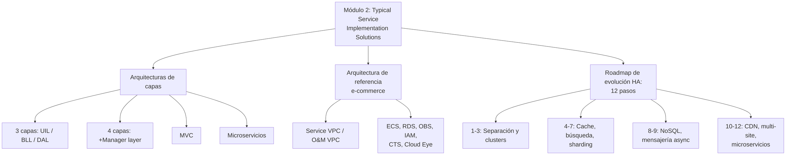
```mermaid
%%{init: {"themeVariables": {"fontSize": "24px"}, "flowchart": {"useMaxWidth": false, "nodeSpacing": 75, "rankSpacing": 75}}}%%
flowchart TD
    M2["Módulo 2: Typical Service<br/>Implementation Solutions"]
    M2 --> A["Arquitecturas de capas"]
    A --> A1["3 capas: UIL / BLL / DAL"]
    A --> A2["4 capas: +Manager layer"]
    A --> A3[MVC]
    A --> A4[Microservicios]
    M2 --> B["Arquitectura de referencia<br/>e-commerce"]
    B --> B1["Service VPC / O&M VPC"]
    B --> B2["ECS, RDS, OBS, IAM,<br/>CTS, Cloud Eye"]
    M2 --> C["Roadmap de evolución HA:<br/>12 pasos"]
    C --> C1["1-3: Separación y clusters"]
    C --> C2["4-7: Cache, búsqueda, sharding"]
    C --> C3["8-9: NoSQL, mensajería async"]
    C --> C4["10-12: CDN, multi-site,<br/>microservicios"]
```

---

### Notas y capturas propias

Espacio para agregar capturas propias del módulo. Guardar las imágenes en
`screenshots/02-typical-service-implementation-solutions-on-the-cloud/` y
referenciarlas acá, por ejemplo:

```markdown

```

---

## Módulo 3 — Cloud Compute Solution Design

> Fuente: `pdfs/3. Cloud Compute Solution Design.pdf` ·
> Extracción cruda: `raw/03-cloud-compute-solution-design/module.md`

### Objetivos del módulo

Al finalizar esta lección se debe poder:

- Entender los servicios básicos de cómputo de Huawei Cloud
- Optimizar la arquitectura de cómputo en base a los cinco principios

Contenidos del módulo:

1. Servicios típicos de cómputo de Huawei Cloud
2. Cinco principios del diseño de soluciones de cómputo

> Esta lección describe las características de **ECS** (Elastic Cloud
> Server), la selección de instancia, el modo de inicialización y la
> selección de solución de almacenamiento, además de las definiciones,
> características y escenarios de aplicación de **BMS** (Bare Metal
> Server) y **DeH** (Dedicated Host). También discute los cinco
> principios de la arquitectura de cómputo.

---

### 1. Servicios típicos de cómputo de Huawei Cloud

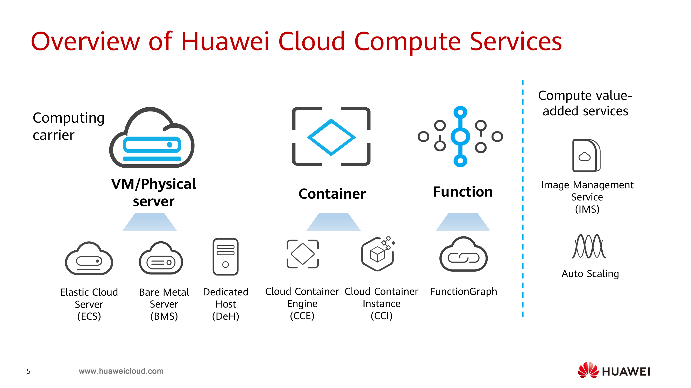

Los **compute carriers** (portadores de cómputo) son VM/servidor físico y
container; sobre ellos se ofrecen servicios de valor agregado: **IMS**
(Image Management Service), Auto Scaling, y los servicios concretos:
**ECS**, **BMS**, **DeH**, **CCE** (Cloud Container Engine), **CCI** (Cloud
Container Instance) y **FunctionGraph** (Function Service).

#### 1.1 ECS (Elastic Cloud Server)

**ECS** es un servidor cloud de cómputo escalable y a demanda, para
aplicaciones seguras, flexibles y eficientes, que asegura una operación
estable e ininterrumpida.

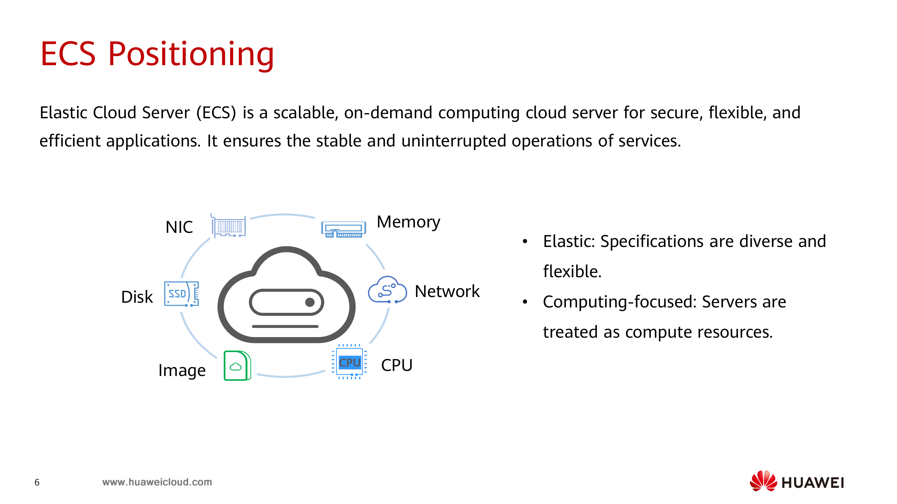

- **Elástico**: especificaciones diversas y flexibles.
- **Centrado en cómputo**: los servidores se tratan como recursos de
  cómputo.

##### Instance Flavor (especificación de instancia)

La nomenclatura de una instancia (ej. `c6.8xlarge.4`) codifica:

- **Instance type** (tipo de instancia): por ejemplo `s` = general
  purpose (uso general), `c` = computing (cómputo), `m` = memory-optimized
  (optimizado para memoria).
- **Instance generation** (generación): un número mayor indica una
  generación más nueva, generalmente más costo-efectiva (ej. `c6` =
  sexta generación).
- **Instance specifications** (especificación de tamaño): cantidad de
  vCPUs — small, medium, large, xlarge, 2xlarge, 4xlarge, 8xlarge, etc.
- **Memory/vCPU ratio** (relación memoria/vCPU): por ejemplo, `4` indica
  4 GiB de memoria por cada vCPU.

##### Tipos de instancia disponibles

General computing (uso general), general computing-basic, large-memory
(memoria grande), disk-intensive (intensivo en disco), GPU-accelerated,
FPGA-accelerated, Kunpeng memory-optimized, Kunpeng ultra-high I/O, entre
otros.

**Tips para elegir el tipo de instancia:**

- Elegir según las características del módulo/componente que va a correr
  en la instancia, no según la industria o aplicación específica.
- Evaluar el uso de recursos y elegir la especificación adecuada.
- No es una decisión única: se puede optimizar luego según métricas de
  monitoreo, verificar si los recursos clave están bien utilizados, y
  cambiar el tipo de instancia (comprando un nuevo ECS) si hay
  desperdicio de recursos.

**Discusión — selección de instancia para aplicaciones de gaming**
(ejemplo de mapeo componente → tipo de instancia):

| Componente | Tipo de instancia | Notas |
|---|---|---|
| Módulo de IA para experiencia personalizada / sitios de alto rendimiento / apps empresariales de carga media-alta | **C7** (general computing-plus) | 2–128 vCPUs, PPS máx. 12 millones, Intel Xeon Skylake |
| Streaming de video del juego (renderizado 3D / deep learning) | **G6v/P2vs** (GPU-accelerated) | NVIDIA T4, 8.1 TFLOPS de precisión simple |
| Servicio de base de datos (relacional, NoSQL, Elasticsearch) | **I7** (ultra-high I/O) | PPS máx. 8 millones, 40 Gbit/s de ancho de banda intranet |
| Servicio frontend con visión artificial / reconocimiento de voz / NLP | **Ai1** (AI-accelerated) | 1–16 Ascend 310, basado en la tarjeta acelerador Atlas 300I |

##### Comparación de especificaciones de ECS: ¿más servidores chicos o menos servidores grandes?

- El **blast radius** (radio de impacto) de un incidente es menor con
  varios servidores de especificación baja.
- Agregar varios servidores de baja especificación cuesta menos.
- **Regla**: elegir la especificación en base a la escala real del
  servicio.

##### Inicialización de un ECS

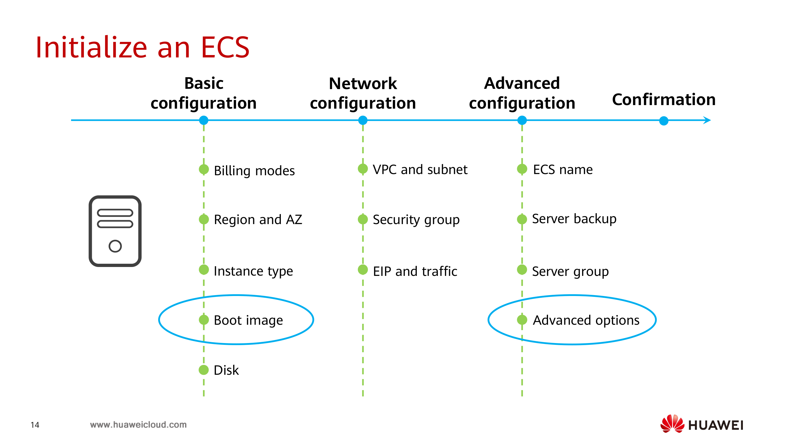

Los cuatro pasos de configuración son: **básica** (billing mode, region/AZ,
instance type, boot image), **red** (VPC y subred, security group, EIP),
**avanzada** (server group, opciones avanzadas, disco) y **confirmación**.

**Usando una imagen (image):**

Una **image** es una plantilla de entorno de ECS: contiene restricciones
de tipo de recurso de VM y un OS, y permite crear ECSs idénticos.

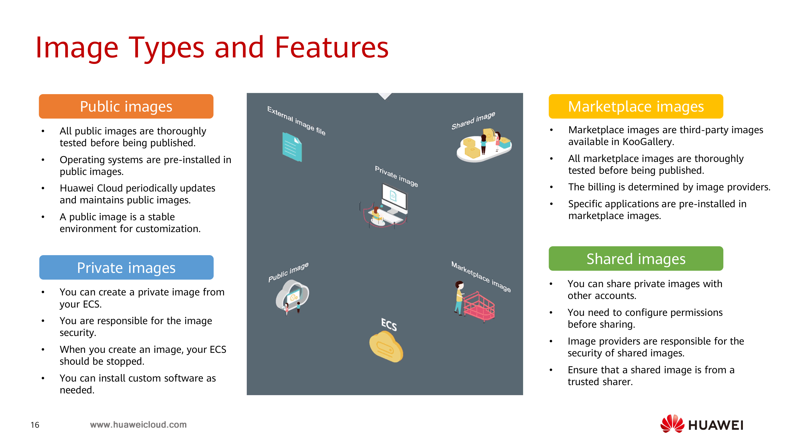

- **Public images** (públicas): probadas exhaustivamente antes de
  publicarse, con OS preinstalado, actualizadas periódicamente por
  Huawei Cloud — entorno estable para personalizar.
- **Private images** (privadas): se crean a partir de un ECS propio (que
  debe estar detenido); el usuario es responsable de su seguridad y
  puede instalar software a medida.
- **Marketplace images**: imágenes de terceros disponibles en
  **KooGallery**, también probadas exhaustivamente; el billing lo define
  el proveedor de la imagen.
- **Shared images** (compartidas): se pueden compartir imágenes privadas
  con otras cuentas (requiere configurar permisos); el proveedor de la
  imagen es responsable de su seguridad.

**Usando scripts (user data):**

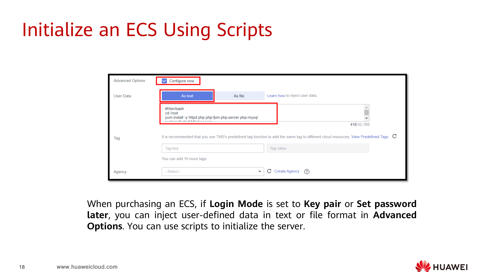

- **User data**: interacción de datos entre el usuario y el servidor; en
  un formato específico se puede tratar como un script (Bash, PowerShell,
  Batch, etc.). Tamaño máximo: 32 KB (para scripts más grandes, guardarlos
  en OBS y descargarlos/ejecutarlos desde ahí).
- **Execute once**: solo se ejecuta la primera vez que el servidor
  arranca después de la compra; modificar el user data de un servidor ya
  iniciado no tiene efecto.
- El servidor arranca antes de que termine la ejecución del script; se
  puede iniciar sesión en el servidor antes de que termine.

**Imagen vs. scripts — ventajas y desventajas:**

| | Private image | Initialization script |
|---|---|---|
| Ventajas | Arranque rápido (solo requiere la imagen), fácil de usar | Flexible, actualizaciones casi en tiempo real (integrado con OBS), estable, controlable y con cambios trazables |
| Desventajas | Actualización lenta de la imagen, alto costo (el storage de imágenes privadas se cobra) | Ejecución lenta de scripts complejos, alto requisito técnico para escribirlos |

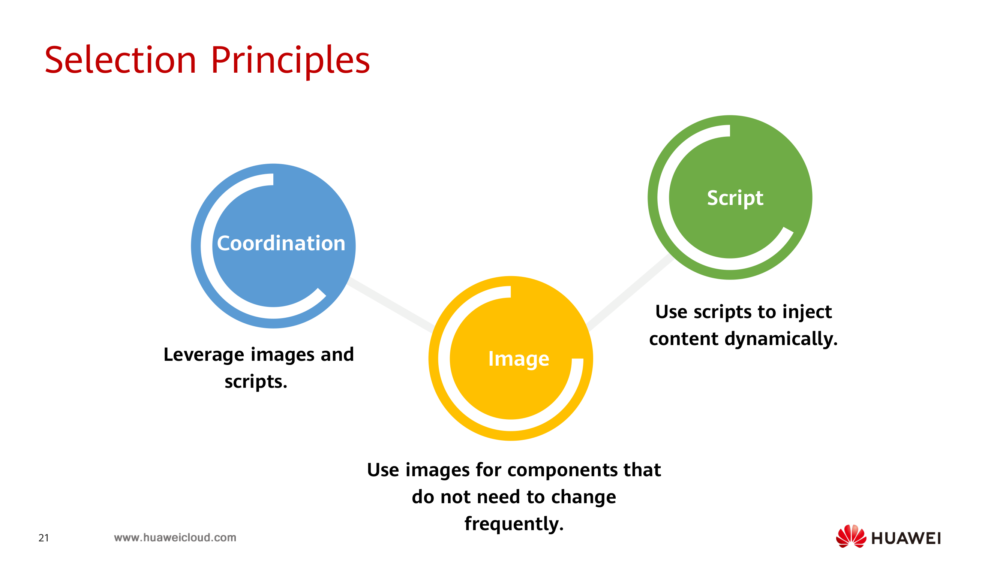

**Principio de selección**: usar **images** para componentes que no
cambian frecuentemente, y **scripts** para inyectar contenido de forma
dinámica; lo habitual es combinar ambos (**coordination**).

##### Selección de modo de almacenamiento

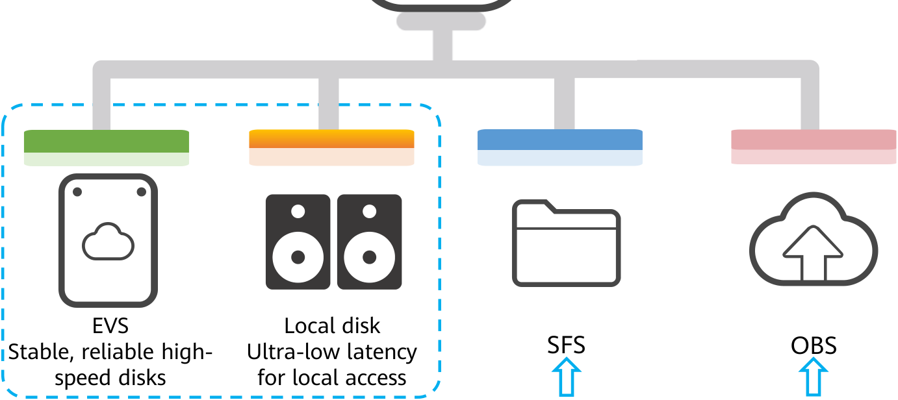

- **EVS** (Elastic Volume Service): discos estables y confiables de alta
  velocidad.
- **Local disk** (disco local): latencia ultra baja para acceso local.
- **SFS** (Scalable File Service): sistema de archivos.
- **OBS** (Object Storage Service): almacenamiento de objetos, acceso vía
  API.

###### Características de los local disks de ECS

- Latencia ultra baja, IOPS muy alto.
- Disponibles solo para algunos tipos de instancia (ej. `i3`, `d6`).
- Solo se cobra la instancia: el disco local está incluido en su costo.
- Menor confiabilidad de datos.
- **Escenario de uso**: datos no críticos o recuperables (ej. swap files
  o caché).

###### Comparación entre soluciones de almacenamiento

| Ítem | EVS | Local Disk | SFS | OBS |
|---|---|---|---|---|
| Modelo de trabajo | Block storage (almacenamiento en bloques), usado como discos | — | File storage, accedido vía sistema de archivos de red | Object storage, accedido vía APIs |
| Confiabilidad | Múltiples copias en una sola AZ — 9 nueves (99.9999999%) | Sin diseño de alta disponibilidad; se pierde si el servidor se detiene | 10 nueves (99.99999999%) | Múltiples copias en múltiples AZs — 12 nueves (99.9999999999%) |
| Control de seguridad | Encriptación EVS | Encriptación de OS | Encriptación SFS | Encriptación OBS |
| Rendimiento | Latencia en milisegundos, alto ancho de banda | Latencia ultra baja para acceso local | 3–20 ms de latencia | 10 ms de latencia, alta concurrencia y throughput |
| Límite de espacio | Hasta 32 TB por disco, pre-compra | Según el tipo de instancia | Sin límite (según el tipo) | Sin límite de cantidad/espacio; hasta 48 TB por objeto |
| Costo | Alto — los discos EVS deben usarse con servidores | Gratis — incluido en el costo de la instancia | Distintos tipos de sistema de archivos | Bajo — distintas clases de almacenamiento disponibles |
| Acceso desde Internet | No (debe estar adjunto a un servidor) | — | No (debe montarse en servidores con una dirección de red específica) | Sí (el acceso público requiere permisos) |
| Escenario de aplicación | Cargas de trabajo en discos tradicionales | — | Compartir archivos, procesamiento de medios, gestión de contenido | Almacenamiento masivo, fuente de datos para big data, archivado, distribución de datos en Internet |

#### 1.2 DeH (Dedicated Host)

Un **DeH** es un servidor físico totalmente dedicado a los servicios
propios del usuario, que garantiza el rendimiento al aislar los recursos
de cómputo.

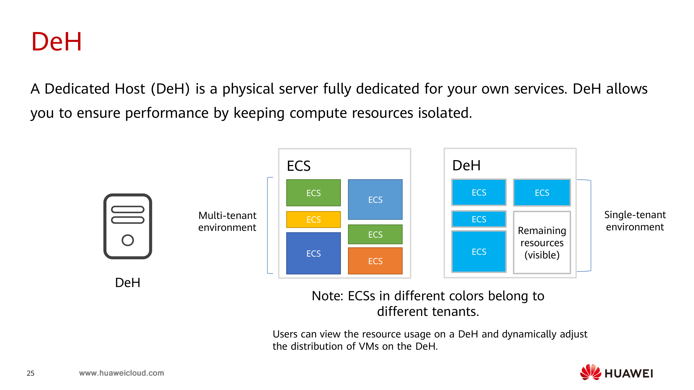

El usuario puede ver el uso de recursos del DeH y ajustar dinámicamente
la distribución de VMs sobre él.

**Características del DeH:**

- **Exclusive** (exclusivo): hostea solo los ECS del usuario, asegurando
  alto rendimiento y estabilidad de cómputo.
- **Flexible**: permite escalar los ECS desplegados en el DeH según los
  requisitos del servicio, facilitando mejorar la utilización de
  recursos.
- **Cost-effective** (costo-efectivo): se pueden reutilizar licencias de
  software ya vinculadas al servidor (inversiones existentes).
- **Secure** (seguro): aislamiento de cómputo a nivel de host para
  cumplir requisitos de compliance.

#### 1.3 BMS (Bare Metal Server)

Un **BMS** provee servidores físicos dedicados en entornos single-tenant
(de un solo inquilino). Combina la escalabilidad de un ECS con la
estabilidad de un servidor físico, para el rendimiento y seguridad que
requieren las aplicaciones core.

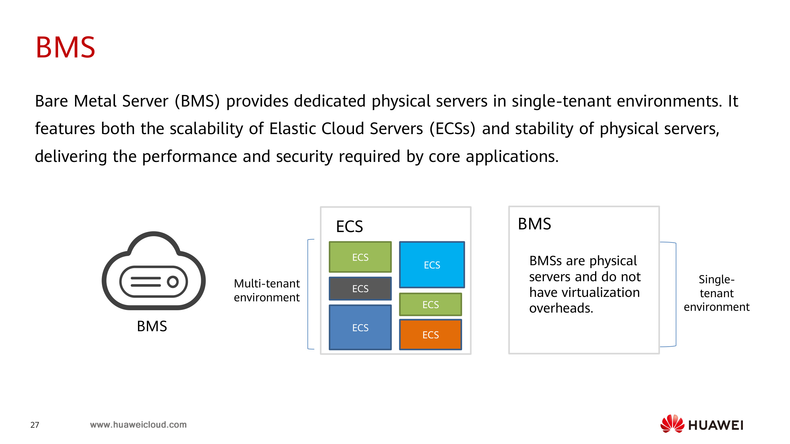

A diferencia de un ECS, un BMS es un servidor físico sin overhead de
virtualización.

**Funciones del BMS:**

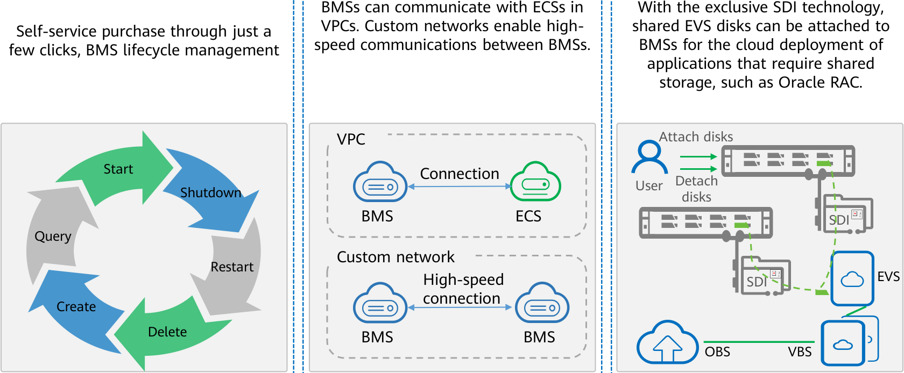

- **Aprovisionamiento en menos de 5 minutos**: compra self-service en
  pocos clicks; gestión del ciclo de vida del BMS (crear, iniciar,
  detener, reiniciar, eliminar, consultar).
- **Comunicación con ECS**: los BMS se comunican con ECS dentro de VPCs;
  redes personalizadas habilitan comunicación de alta velocidad entre
  BMS.
- **Discos EVS compartidos**: con tecnología **SDI** exclusiva, se pueden
  adjuntar discos EVS compartidos a BMS para el despliegue cloud de
  aplicaciones que requieren almacenamiento compartido (ej. Oracle RAC).

**Escenarios de aplicación de BMS:**

- Bases de datos core (ej. bases Oracle típicas, entornos de desarrollo y
  testing empresarial)
- Computación de alto rendimiento (supercomputación, biofarmacéutica,
  ingeniería genética)
- Alta seguridad (sector de valores, gobierno y finanzas empresarial,
  seguros)
- Big data (almacenamiento masivo, análisis de datos masivos)

---

### 2. Cinco principios del diseño de soluciones de cómputo

Los mismos cinco principios del Módulo 1 (**Security, Reliability,
Performance, Cost-effectiveness, Maintainability**) aplicados a la capa de
cómputo, sobre una arquitectura de ejemplo:

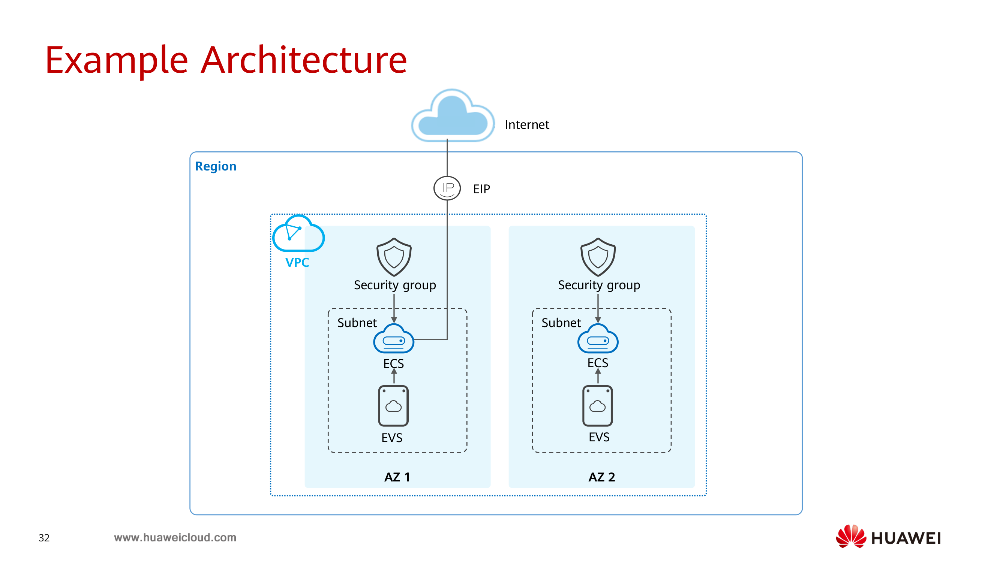

#### 2.1 Security (seguridad)

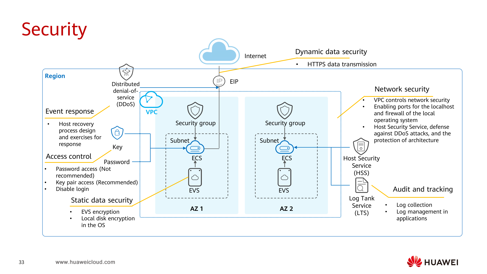

- **Seguridad de datos dinámicos**: transmisión de datos vía **HTTPS**.
- **Seguridad de red**: controles de seguridad de red, habilitación de
  puertos para el localhost y firewall del OS local; **HSS** (Host
  Security Service) para defensa contra **DDoS** y protección de
  arquitectura.
- **Control de acceso**: acceso por contraseña (no recomendado), acceso
  por **key pair** (recomendado), o deshabilitar el login.
- **Seguridad de datos estáticos**: encriptación de EVS y encriptación de
  disco local en el OS.
- **Auditoría y trazabilidad**: **LTS** (Log Tank Service) para
  recolección y gestión de logs de aplicación.
- **Respuesta a eventos**: proceso de recuperación de host, diseño de
  ejercicios y respuesta ante incidentes.

#### 2.2 Reliability (confiabilidad)

Un ECS se despliega en un solo nodo: hay que considerar la confiabilidad
de la solución.

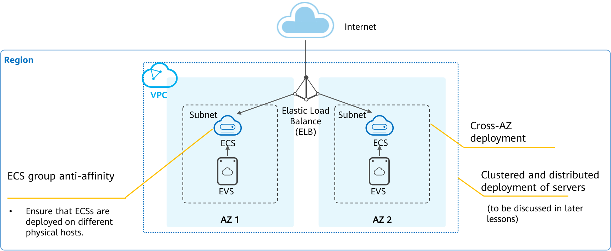

- **ELB** (Elastic Load Balance) para despliegue cross-AZ.
- **Anti-afinidad de grupo de ECS** (ECS group anti-affinity): asegura
  que los ECS se desplieguen en distintos hosts físicos.
- Despliegue en clúster y distribuido de servidores (se profundiza en
  lecciones posteriores).

#### 2.3 Performance (rendimiento)

En la mayoría de los casos, el servidor está esperando datos.

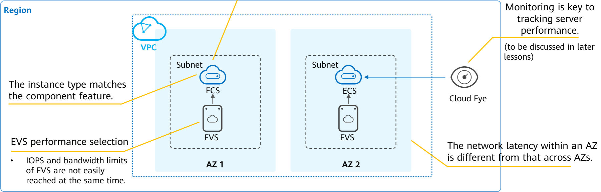

- El **monitoreo** (con **Cloud Eye**) es clave para seguir el
  rendimiento del servidor.
- El **instance type** debe coincidir con las características del
  componente.
- Selección de rendimiento de EVS: los límites de **IOPS** y ancho de
  banda de EVS no suelen alcanzarse al mismo tiempo.
- La latencia de red dentro de una AZ es distinta a la latencia entre
  AZs.

#### 2.4 Costs (costos)

1. **Instance type**: elegir según las características de los
   componentes que corren en el servidor.
2. **Instance scale** (escala de instancia): elegir una instancia que
   aproveche al máximo los recursos del host.
3. **Billing modes** (modos de facturación): pay-per-use (pago por uso),
   anual/mensual, y **spot pricing**; facturación por tráfico (el tráfico
   entrante es gratis, y el tráfico saliente de red privada dentro de la
   misma región también).
4. **Scalability** (escalabilidad): estimar cambios de tráfico y definir
   políticas de **scaling**; balancear tráfico y cómputo.
5. **Smart consumption** (consumo inteligente): detener el ECS cuando no
   se usa (los discos EVS no desadjuntados y el EIP no liberado seguirán
   facturándose; solo se detiene la facturación del ECS).
6. **Monitoring** (monitoreo): seguir el uso de recursos y optimizar la
   configuración continuamente.

> Detalle de precios: calculadora oficial de Huawei Cloud (sección ECS).

#### 2.5 O&M (operación y mantenimiento)

1. O&M de ECS
2. Parches del sistema operativo
3. Upgrades de software de aplicación
4. Upgrades de aplicaciones propias (self-built)
5. Backup de datos y backups de host
6. Otro mantenimiento relacionado con seguridad (visto antes)

---

### Quiz del módulo

**(Selección múltiple) ¿Cuáles de las siguientes afirmaciones sobre el uso
de scripts para inicializar un servidor son verdaderas?**

A. Se pueden usar distintos tipos de scripts para inicializar un
servidor, como Bash y PowerShell.
B. Si los scripts son muy grandes, se pueden guardar en un bucket OBS e
inyectarlos como archivos que se descargan y ejecutan luego de crear el
servidor.
C. Para actualizar los scripts, se pueden modificar los scripts en el
servidor ya iniciado.
D. Antes de que termine la ejecución, se puede iniciar sesión en el
servidor.

*(Verdaderas: A, B y D — según el contenido de la sección "Initialize an
ECS Using Scripts": el user data soporta múltiples formatos de script
(A), los scripts grandes se recomienda guardarlos en OBS y descargarlos
(B), y se puede loguear al servidor antes de que termine la ejecución
del script (D). C es falsa: modificar el user data de un servidor ya
iniciado **no tiene efecto**, ya que el script solo se ejecuta una vez,
en el primer arranque tras la compra — "execute once".)*

### Acrónimos y abreviaturas

- **BYOL**: Bring Your Own License
- **SFS**: Scalable File Service
- **DDoS**: Distributed Denial-of-Service
- **HSS**: Host Security Service
- **LTS**: Log Tank Service
- **IMS**: Image Management Service
- **CCE**: Cloud Container Engine
- **CCI**: Cloud Container Instance
- **SDI**: (tecnología de virtualización de E/S de Huawei Cloud para
  discos compartidos en BMS)

---

### Resumen del módulo

- **ECS** es el cómputo elástico central de Huawei Cloud; su "instance
  flavor" codifica tipo, generación, tamaño y relación memoria/vCPU.
- La elección de instancia debe basarse en el componente que corre en
  ella, no en la industria; conviene preferir varios servidores chicos a
  pocos grandes (menor **blast radius**).
- **Imágenes** (arranque rápido, actualización lenta) y **scripts/user
  data** (flexibles, ejecución una sola vez) son las dos formas de
  inicializar un ECS, y suelen combinarse.
- **DeH** y **BMS** son alternativas dedicadas/single-tenant a ECS para
  cargas que requieren aislamiento físico, alto rendimiento o compliance.
- Los cinco principios se aplican también a la capa de cómputo: HSS y
  encriptación (security), anti-afinidad y ELB cross-AZ (reliability),
  Cloud Eye (performance), billing modes (cost).

### Mapa conceptual

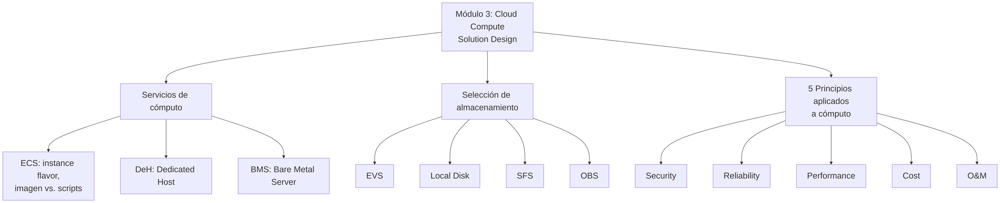
```mermaid
%%{init: {"themeVariables": {"fontSize": "24px"}, "flowchart": {"useMaxWidth": false, "nodeSpacing": 75, "rankSpacing": 75}}}%%
flowchart TD
    M3["Módulo 3: Cloud Compute<br/>Solution Design"]
    M3 --> A["Servicios de cómputo"]
    A --> A1["ECS: instance flavor,<br/>imagen vs. scripts"]
    A --> A2["DeH: Dedicated Host"]
    A --> A3["BMS: Bare Metal Server"]
    M3 --> B["Selección de almacenamiento"]
    B --> B1[EVS]
    B --> B2["Local Disk"]
    B --> B3[SFS]
    B --> B4[OBS]
    M3 --> C["5 Principios aplicados<br/>a cómputo"]
    C --> C1[Security]
    C --> C2[Reliability]
    C --> C3[Performance]
    C --> C4[Cost]
    C --> C5["O&M"]
```

---

### Notas y capturas propias

Espacio para agregar capturas propias del módulo. Guardar las imágenes en
`screenshots/03-cloud-compute-solution-design/` y referenciarlas acá, por
ejemplo:

```markdown

```

---

## Módulo 4 — Cloud Storage Solution Design

> Fuente: `pdfs/4. Cloud Storage Solution Design.pdf` ·
> Extracción cruda: `raw/04-cloud-storage-solution-design/module.md`

### Objetivos del módulo

Al finalizar esta lección se debe poder entender:

- Funciones y características de **OBS** (Object Storage Service)
- Selección de especificaciones de **SFS** (Scalable File Service) y
  **EVS** (Elastic Volume Service)
- Los cinco principios para diseñar soluciones de almacenamiento

Contenidos del módulo:

1. Resumen de servicios de almacenamiento
2. Principios de diseño de soluciones de almacenamiento
3. Prácticas de servicios de cómputo y almacenamiento

> Esta lección da un panorama de las soluciones de almacenamiento de
> Huawei Cloud, incluyendo los servicios básicos (OBS, SFS y EVS) y los
> cinco principios de diseño de soluciones.

---

### 1. Resumen de servicios de almacenamiento

Arquitectura típica de almacenamiento sobre una **Region** con dos AZs,
cada una con ECS + EVS, conectada a OBS y, opcionalmente, a un datacenter
empresarial o a clouds públicos de terceros vía **Cloud Storage Gateway
(CSG)**:

- **OBS** (Object Storage Service): almacenamiento de objetos para datos
  no estructurados (documentos, imágenes, audio, video).
- **EVS** (Elastic Volume Service): almacenamiento en bloques distribuido
  y escalable, los discos de los ECS.
- **SFS** (Scalable File Service): almacenamiento de archivos compartido
  y totalmente administrado para ECS, vía **NFS/CIFS**; también ofrece la
  edición mejorada **SFS Turbo**.
- **CBR** (Cloud Backup and Recovery): respalda ECS y discos EVS para
  asegurar la integridad de los datos.
- **SDRS** (Storage Disaster Recovery Service): DR cross-AZ con **RPO**
  cero, basado en replicación síncrona de datos.
- **DSS** (Dedicated Distributed Storage Service): recursos de
  almacenamiento físico exclusivo, basado en almacenamiento en bloques
  distribuido.
- **DES** (Data Express Service): transmite datos a la nube usando medios
  físicos de almacenamiento (ej. discos duros externos).
- Aceleración **WAN** y migración de datos entre el datacenter
  empresarial / clouds de terceros y Huawei Cloud.

#### 1.1 OBS (Object Storage Service)

OBS es un servicio de almacenamiento de objetos seguro y altamente
confiable que permite guardar grandes volúmenes de datos a bajo costo,
accesible vía **REST API** (HTTP/Swift).

- **Fully managed** (totalmente administrado)
- Accesible por Internet
- Almacenamiento ilimitado (hasta 48 TB por objeto individual)
- Confiabilidad de **99.9999999999%**
- Notificaciones de eventos
- Varias soluciones costo-efectivas (clases de almacenamiento)

##### Empezando con OBS

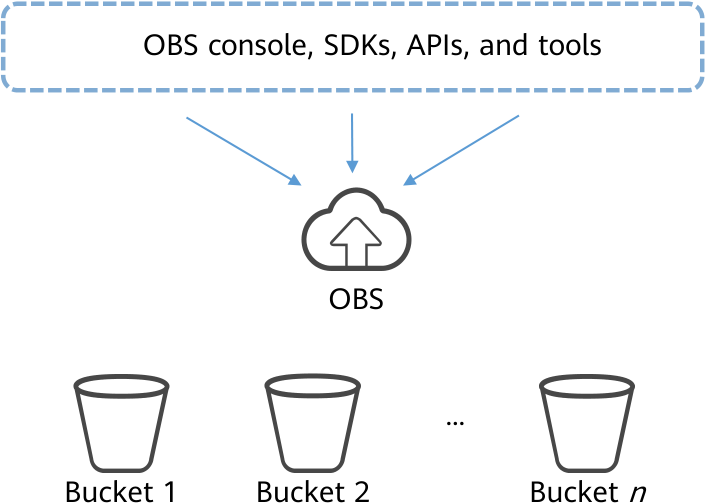

- Se accede a OBS vía consola, SDKs, APIs y herramientas.
- Para guardar objetos primero hay que crear un **bucket**: la unidad de
  gestión de OBS.
- Un bucket puede contener cualquier cantidad de **objects**: la unidad
  lógica de almacenamiento de OBS (documentos, imágenes, audio, etc.).
- Conviene agrupar en un mismo bucket objetos con el mismo atributo o
  asociados al mismo servicio, para asignarles políticas de gestión
  unificadas.

##### Identificación de un objeto

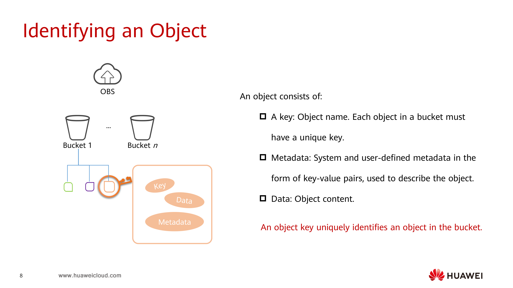

Un objeto consiste en:

- **Key**: el nombre del objeto. Cada objeto en un bucket debe tener una
  key única.
- **Metadata**: metadatos de sistema y definidos por el usuario, en
  pares clave-valor, que describen al objeto.
- **Data**: el contenido del objeto.

La key identifica de forma única a un objeto dentro del bucket.

##### Confiabilidad y disponibilidad de OBS

**Confiabilidad de 99.9999999999%, disponibilidad de 99.995%**

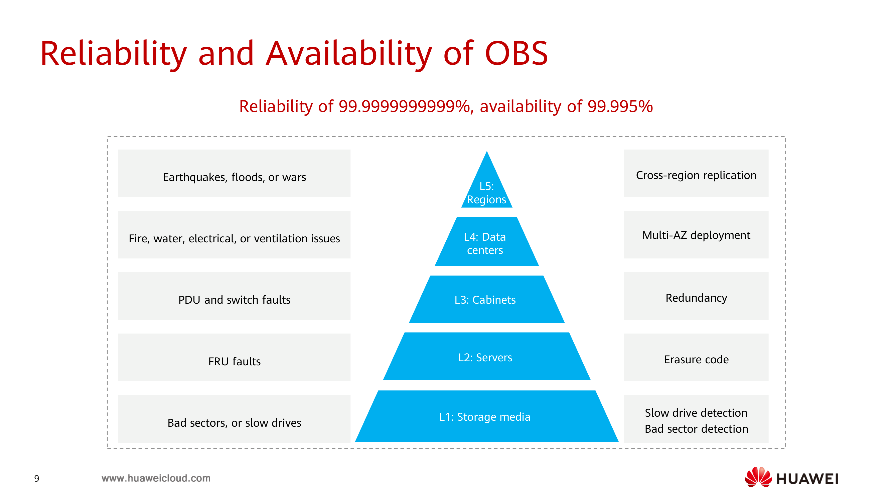

Capas de protección ante distintos tipos de falla:

- **L1 — Storage media** (medios de almacenamiento): detección de
  sectores defectuosos o discos lentos.
- **L2 — Servers** (servidores): **erasure code** (código de borrado)
  ante fallas de **FRU**.
- **L3 — Cabinets** (gabinetes): redundancia ante fallas de PDU y switch.
- **L4 — Data centers**: despliegue multi-AZ ante incendios, problemas
  eléctricos o de ventilación.
- **L5 — Regions**: replicación cross-region ante terremotos,
  inundaciones o guerras.

##### Replicación cross-region de OBS

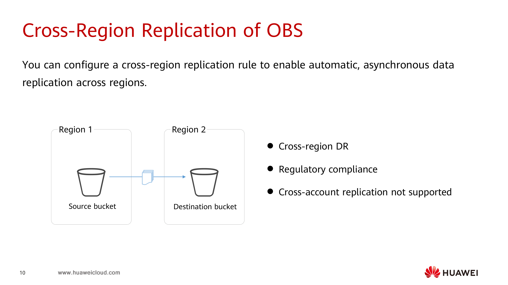

Se puede configurar una regla de **cross-region replication** para
replicación de datos automática y asíncrona entre regiones.

- Útil para **DR cross-region** y cumplimiento normativo
  (**regulatory compliance**).
- No soporta replicación cross-account.

##### Hospedar un sitio web en OBS

Es posible alojar un **static website** (sitio estático) directamente en
un bucket de OBS, mapeando el dominio propio mediante **CNAME** hacia el
dominio del bucket. Para que los visitantes accedan al contenido, hay que
configurar permisos sobre los objetos y el bucket.

##### Otorgar permisos en OBS — Bucket policies

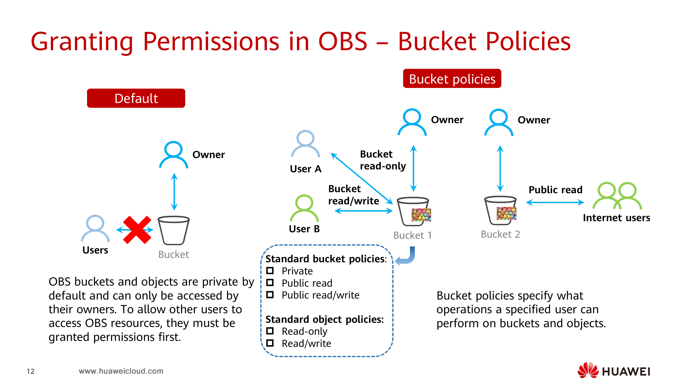

Por defecto, los buckets y objetos de OBS son **privados** y solo el
owner puede acceder a ellos. Para que otros usuarios accedan, hay que
otorgarles permisos explícitamente.

- **Bucket policies estándar**: Private (privado), Public read (lectura
  pública), Public read/write (lectura/escritura pública).
- **Object policies estándar**: Read-only, Read/write.
- Las bucket policies especifican qué operaciones puede realizar un
  usuario específico sobre buckets y objetos.

##### Otorgar permisos en OBS — ACLs

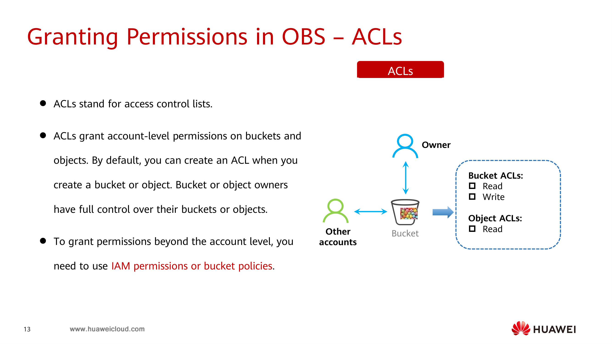

- **ACL** (Access Control List): otorga permisos a nivel de cuenta sobre
  buckets y objetos. Por defecto se crea una ACL al crear el bucket u
  objeto, y el owner tiene control total.
- Para otorgar permisos más allá del nivel de cuenta, se necesitan
  **IAM permissions** o **bucket policies**.

##### Ejemplo de bucket policy

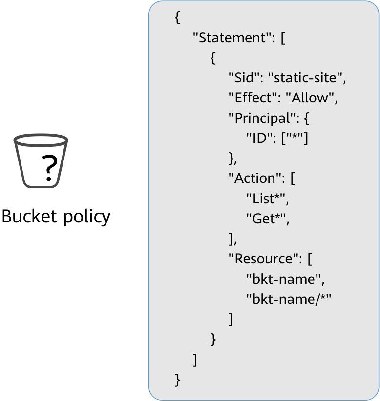

Una declaración de bucket policy se compone de:

- **Principals**: quién puede acceder a los recursos.
- **Actions**: qué acciones están permitidas o denegadas.
- **Resources**: a qué recursos se puede acceder.
- **Conditions**: cuándo se aplica la política.
- **Effects**: si la acción se permite o se deniega.

##### Firmar una URL para acceso temporal

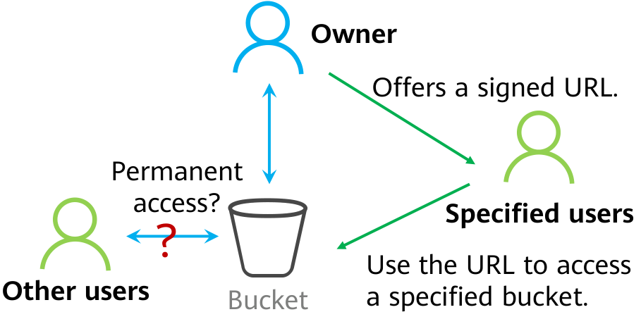

Los objetos son privados por defecto; para dar acceso temporal a otros
usuarios se firma una URL (**signed URL**, generalmente generada por
código):

- Tiene un período de validez.
- Solo es válida mientras el **AK/SK** usado para la firma sea válido.
- Los usuarios especificados pueden usarla para realizar las operaciones
  indicadas dentro del período de validez.

##### Guardar backups en OBS

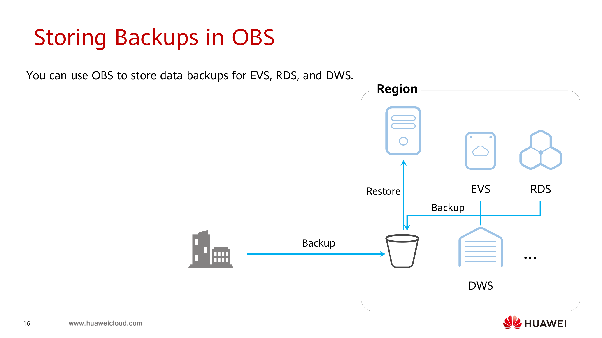

OBS puede almacenar backups de datos de **EVS**, **RDS** y **DWS**.

##### Gestión de versiones de objetos

El **versioning** (versionado) está deshabilitado por defecto en buckets
nuevos: los objetos existentes se sobrescriben con los nuevos. Si se
habilita, OBS crea automáticamente un **version ID** único por cada
objeto subido. Al eliminar un objeto, OBS inserta un **delete marker**
(marcador de borrado) en su lugar, pero el objeto se puede recuperar. Se
factura el almacenamiento de todas las versiones que no tengan delete
marker.

**Una forma de eliminar versiones históricas:**

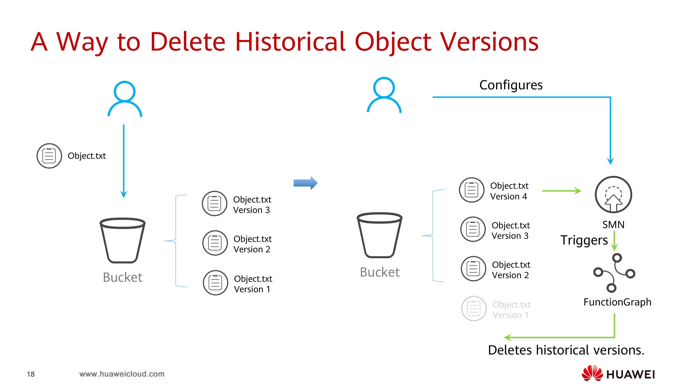

Se puede configurar **SMN** (Simple Message Notification) para disparar
una función de **FunctionGraph** que elimine las versiones históricas de
un objeto.

**Beneficios del versionado:**

- **Accidental deletion protection** (protección ante borrado
  accidental)
- **Multi-version backup** (backup multi-versión)
- **Release rollback** (rollback de releases)

##### Clases de almacenamiento de OBS

| Clase | Uso recomendado (✓) | Evitar (✗) |
|---|---|---|
| **Standard** | Fuente de almacenamiento para distribución de contenido, datos que cambian con frecuencia, sin necesidad de planificar capacidad, demanda de almacenamiento creciente | — |
| **Infrequent Access** (acceso infrecuente) | Datos que no se acceden con frecuencia (ej. backups empresariales, archivos activos); alta confiabilidad, acceso en tiempo real, más económico que Standard | Datos "calientes" de acceso frecuente |
| **Archive** (archivado) | Datos rara vez accedidos pero que no se pueden descartar; alta confiabilidad, más económico que Infrequent Access. **"Archive" no es lo mismo que "backup"** | Código existente diseñado para acceder a sistemas de archivos; transmisión que requiere latencias ultra bajas |

> **WORM** (Write Once Read Many) y cumplimiento normativo o de
> confiabilidad también son casos de uso de Standard.

##### Gestión del ciclo de vida de objetos

Las tres clases (Standard → Infrequent Access → Archive) forman un
**lifecycle** de costo decreciente pero con mayor costo de recuperación:
Standard (precio alto, acceso flexible) → Infrequent Access (precio
medio, costo más alto por más solicitudes) → Archive (precio bajo,
requiere restauración para acceder). Útil por ejemplo para datos
financieros con acceso decreciente en el tiempo.

##### Dos formas de recuperar objetos Archive

- **Restore to retrieve** (restaurar para recuperar): para acceder a un
  objeto Archive, primero hay que restaurarlo; esto crea una copia
  Standard del objeto (no visible en el bucket). Facturado por datos
  recuperados — **Expedited** (1–5 min) o **Standard** (3–5 hs).
- **Direct reading** (lectura directa): si el bucket tiene habilitada la
  lectura directa, los objetos Archive se pueden descargar sin
  restaurarlos antes. Facturado por solicitudes de recuperación —
  Expedited (1–5 min) o Standard (3–5 hs).

#### 1.2 EVS (Elastic Volume Service)

EVS provee los discos de los ECS, por lo que es un servicio obligatorio
(**mandatory service**).

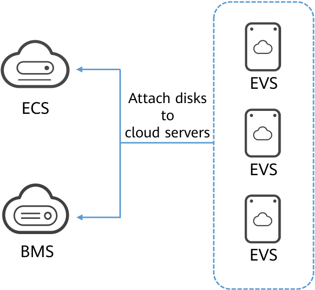

- Redundancia de tres copias en una sola AZ, confiabilidad del
  **99.9999999%**.
- Hasta 32 TB por disco EVS.
- Múltiples especificaciones, con buen rendimiento a precio razonable.
- Los datos de backup se guardan en OBS.

##### Selección del tipo de disco EVS

Métricas clave: **IOPS** (operaciones de lectura/escritura por segundo),
**Throughput** (cantidad de datos leídos/escritos por segundo) y
**Latency** (tiempo entre el envío de una solicitud y su finalización).

| Parámetro | Extreme SSD | Ultra-high I/O | General Purpose SSD | High I/O |
|---|---|---|---|---|
| Descripción | Discos ultrarrápidos para cargas que exigen ancho de banda ultra alto y latencia ultra baja | Discos de alto rendimiento para servicios críticos empresariales, alto throughput y baja latencia | Discos costo-efectivos para aplicaciones empresariales de rendimiento medio | Discos para cargas de acceso común |
| IOPS máx. | 128.000 | 50.000 | 20.000 | 5.000 |
| Throughput máx. | 1.000 MB/s | 350 MB/s | 250 MB/s | 150 MB/s |
| Latencia | 200 μs | 1 ms | 1 ms | 1–3 ms |
| Costo | $$$$ | $$$ | $$ | $ |
| Casos de uso típicos | IOPS y latencia extremas: bases de datos con carga pesada, HPC con file sharing | Optimizado para I/O: aplicaciones intensivas en I/O, discos de sistema de alto rendimiento, file sharing core | Mejor relación costo/throughput: la mayoría de las cargas | Rendimiento de entrada, con burst performance para cargas de presión inestable (ej. discos de arranque) |

#### 1.3 SFS (Scalable File Service)

SFS provee almacenamiento de archivos compartido, confiable y de alto
rendimiento, hospedado en Huawei Cloud. Permite acceso compartido a
archivos entre múltiples ECS, BMS y contenedores de **CCE**/**CCI**.

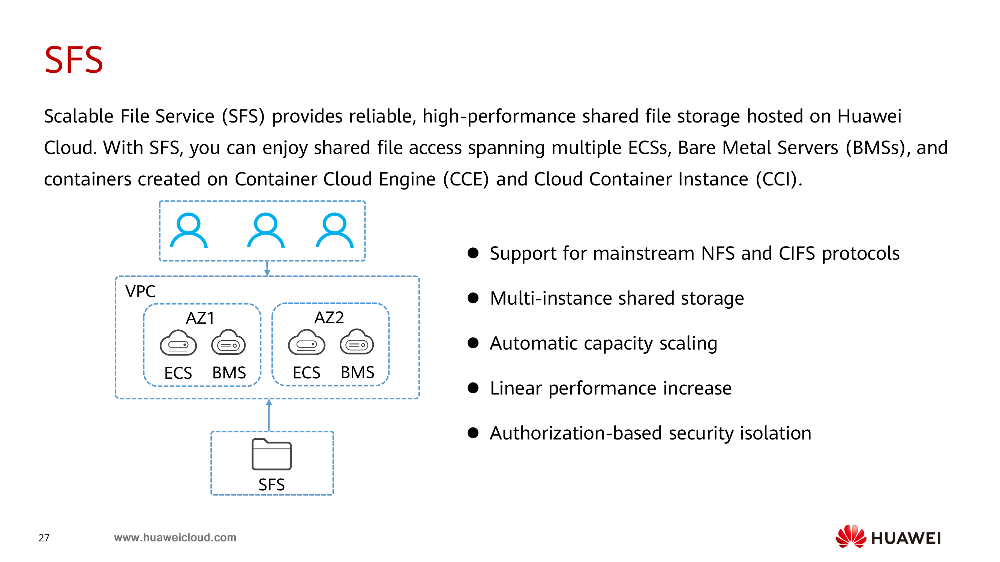

- Soporte para los protocolos estándar **NFS** y **CIFS**.
- Almacenamiento compartido multi-instancia.
- Escalado de capacidad automático.
- Aumento de rendimiento lineal.
- Aislamiento de seguridad basado en autorización.

##### Selección de tipo de sistema de archivos SFS Turbo

| Parámetro | SFS Turbo Standard | SFS Turbo Performance | HPC 40 MB/s/TiB | HPC 250 MB/s/TiB | HPC 1.000 MB/s/TiB |
|---|---|---|---|---|---|
| Ancho de banda máx. | 150 MB/s | 350 MB/s | 8 GB/s | 20 GB/s | hasta 200 GB/s |
| IOPS máx. | 5.000 | 20.000 | 250.000 | 1 millón | 1 millón |
| Latencia | 2–5 ms | 1–2 ms | 2–5 ms | < 1 ms | < 1 ms |
| Capacidad | 500 GB – 32 TB | 500 GB – 32 TB | 3,6 TB – 1 PB | 1,2 TB – 1 PB | — |
| Ventajas | Gran capacidad y bajo costo | Baja latencia y alto IOPS | Gran capacidad y bajo costo | Baja latencia y costo-efectivo | Alto IOPS y alta densidad de rendimiento |
| Casos de uso típicos | Almacenamiento de código/logs, file sharing, OA empresarial | Sitios de alto tráfico, file sharing, gestión de contenido, renderizado de imágenes, entrenamiento de IA, OA empresarial | OA empresarial, gestión de repositorios de código | Entrenamiento de IA, simulación EDA, análisis genético, renderizado de video | Conducción autónoma, IA generativa, EDA en diseño de chips |

---

### 2. Principios de diseño de soluciones de almacenamiento

Los mismos cinco principios (**Architecture, Security, Reliability,
Performance, Cost-effectiveness, Maintainability**) se usan a lo largo de
todo el diseño de arquitectura de soluciones, aplicados ahora a la capa de
almacenamiento sobre una arquitectura de ejemplo:

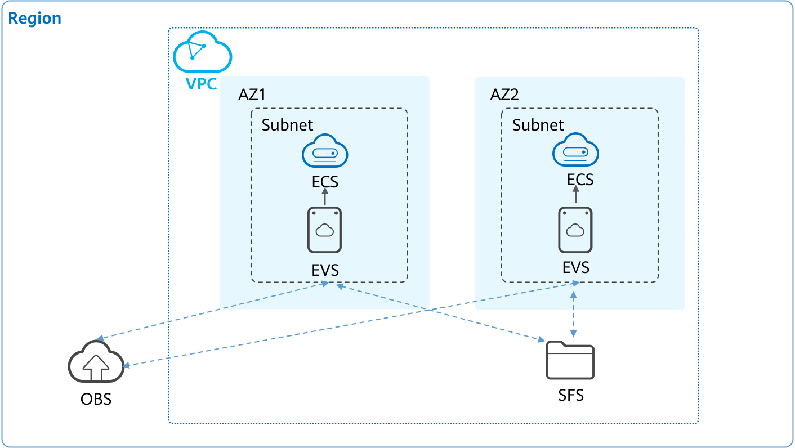

#### 2.1 Storage Security (seguridad del almacenamiento)

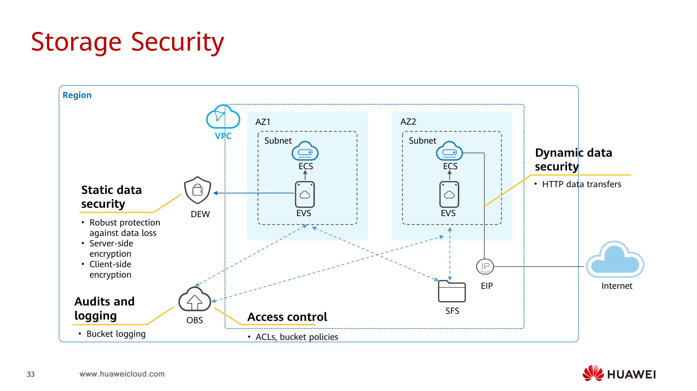

- **Seguridad de datos dinámicos**: transferencias de datos vía HTTP(S).
- **Seguridad de datos estáticos**: protección robusta contra pérdida de
  datos; encriptación server-side y client-side, usando **DEW** (Data
  Encryption Workshop).
- **Control de acceso**: ACLs y bucket policies.
- **Auditoría y logging**: bucket logging.

#### 2.2 Storage Reliability (confiabilidad del almacenamiento)

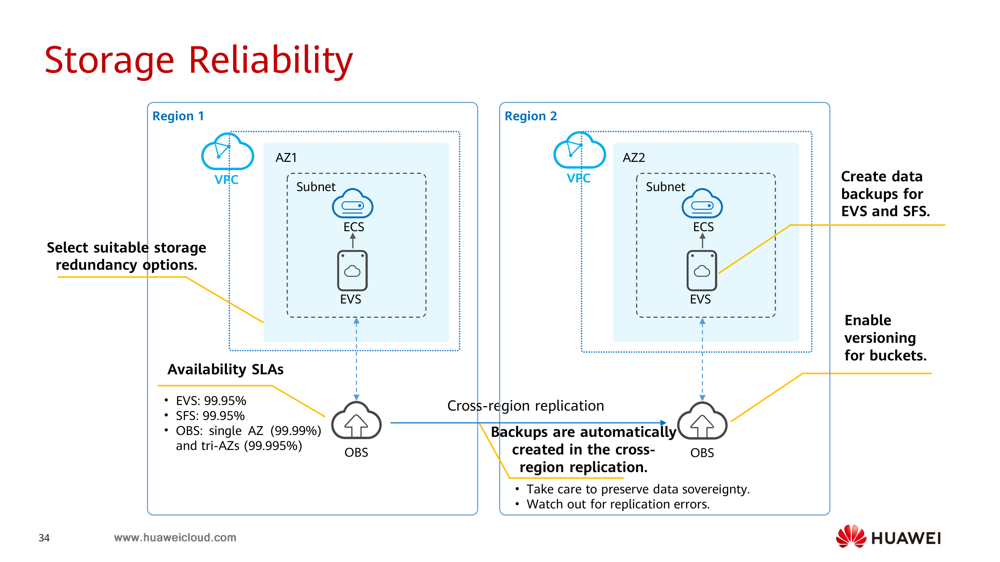

- Crear backups de datos para EVS y SFS.
- Elegir opciones de redundancia adecuadas.
- Habilitar **versioning** en los buckets.
- **SLAs de disponibilidad**: EVS 99.95%, SFS 99.95%, OBS single-AZ
  99.99% y tri-AZ 99.995%.
- Los backups se crean automáticamente en la replicación cross-region.
- Cuidar la **soberanía de datos** (**data sovereignty**) y prestar
  atención a errores de replicación.

#### 2.3 Storage Performance — OBS

Latencia tan baja como 10 ms, con alta concurrencia y ancho de banda.

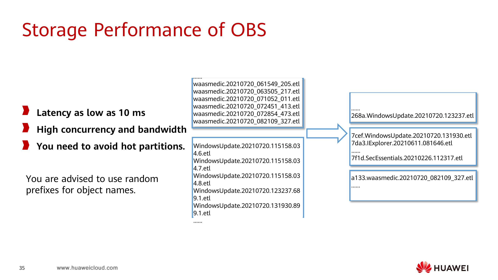

Hay que evitar las **hot partitions** (particiones calientes): se
recomienda usar **prefijos aleatorios** en los nombres de objeto (en
lugar de timestamps secuenciales) para distribuir mejor la carga.

#### 2.4 Storage Cost-effectiveness — OBS

**Almacenamiento y cómputo desacoplados, para costos de almacenamiento
bajos.**

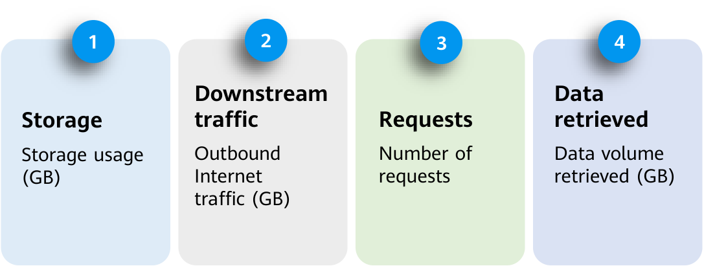

OBS tiene cuatro ítems de facturación: **storage** (almacenamiento),
**traffic** (tráfico), **requests** (solicitudes) y **data retrieval**
(recuperación de datos).

- Elegir la clase de almacenamiento adecuada para reducir costos.
- No usar Infrequent Access para datos "calientes".
- No usar Archive si se necesita recuperar datos de inmediato.
- El tráfico entrante y el tráfico saliente dentro de la misma región son
  gratuitos.
- Hay descuentos en el tráfico de OBS hacia CDN.
- Evitar llamadas a funciones innecesarias para reducir costos.

#### 2.5 Storage Maintainability — OBS

- Al ser un servicio totalmente administrado, requiere poco
  mantenimiento.
- Si el versionado está habilitado, hay que gestionar correctamente las
  versiones históricas.
- Análisis de registros de acceso y gestión de permisos.

---

### 3. Prácticas de servicios de cómputo y almacenamiento

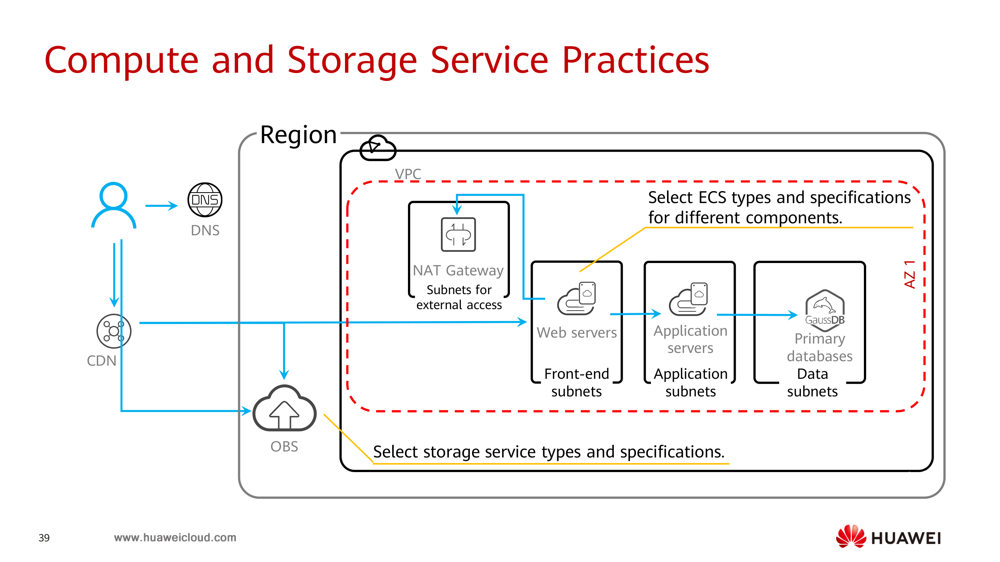

En la práctica, el diseño combina ambas capas sobre una misma **Region**
(`cn-east-3`, AZ 1): se eligen los tipos y especificaciones de ECS según
cada componente (web servers, application servers, primary databases,
detrás de NAT Gateway, CDN y DNS) y, en paralelo, los tipos y
especificaciones de servicio de almacenamiento según cada capa (subredes
de frontend, aplicación y datos, con OBS para contenido estático/backup).

---

### Quiz del módulo

**(Selección simple) Una empresa detectó en una auditoría anual que sus
recursos de OBS estaban sobrepresupuestados. ¿Qué puede hacer para
reducir costos?**

A. Deshabilitar el versionado de los buckets.
B. Optimizar las políticas de acceso para otorgar solo los permisos
necesarios.
C. Configurar políticas de **lifecycle** para mover objetos a clases de
almacenamiento más costo-efectivas.
D. Habilitar la lectura directa (**direct reading**) en los buckets.

*(Respuesta: C — las políticas de lifecycle mueven automáticamente los
objetos entre Standard, Infrequent Access y Archive según su patrón de
acceso, atacando directamente el costo de almacenamiento. B mejora la
seguridad pero no reduce costos de almacenamiento; A y D afectan
funcionalidad/acceso, no el presupuesto.)*

### Acrónimos y abreviaturas

- **CSG**: Cloud Storage Gateway
- **CBR**: Cloud Backup and Recovery
- **SDRS**: Storage Disaster Recovery Service
- **DSS**: Dedicated Distributed Storage Service
- **DES**: Data Express Service
- **WORM**: Write Once Read Many
- **DEW**: Data Encryption Workshop
- **SMN**: Simple Message Notification
- **NAS**: Network Attached Storage
- **URL**: Uniform Resource Locator
- **CCE**: Cloud Container Engine
- **CCI**: Cloud Container Instance

---

### Resumen del módulo

- **OBS** es almacenamiento de objetos fully managed con confiabilidad de
  99.9999999999%, organizado en buckets/objetos y con tres clases de
  costo decreciente (Standard / Infrequent Access / Archive).
- El control de acceso en OBS combina **bucket policies**, **ACLs** y
  **URLs firmadas**; el versionado protege contra borrados accidentales,
  pero factura todas las versiones sin delete marker.
- **EVS** y **SFS** son los otros dos pilares de storage: EVS para
  discos de ECS (bloques), SFS para archivos compartidos (NFS/CIFS),
  cada uno con múltiples tiers de rendimiento.
- Los cinco principios aplicados a storage: evitar **hot partitions**
  con prefijos aleatorios (performance), elegir la clase de storage
  correcta y usar políticas de **lifecycle** (cost-effectiveness).

### Mapa conceptual

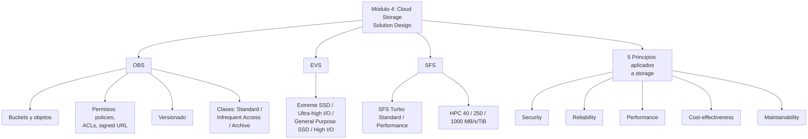
```mermaid
%%{init: {"themeVariables": {"fontSize": "24px"}, "flowchart": {"useMaxWidth": false, "nodeSpacing": 75, "rankSpacing": 75}}}%%
flowchart TD
    M4["Módulo 4: Cloud Storage<br/>Solution Design"]
    M4 --> A[OBS]
    A --> A1["Buckets y objetos"]
    A --> A2["Permisos: policies,<br/>ACLs, signed URL"]
    A --> A3[Versionado]
    A --> A4["Clases: Standard /<br/>Infrequent Access / Archive"]
    M4 --> B[EVS]
    B --> B1["Extreme SSD / Ultra-high I/O /<br/>General Purpose SSD / High I/O"]
    M4 --> C[SFS]
    C --> C1["SFS Turbo Standard / Performance"]
    C --> C2["HPC 40 / 250 / 1000 MB/s/TiB"]
    M4 --> D["5 Principios aplicados<br/>a storage"]
    D --> D1[Security]
    D --> D2[Reliability]
    D --> D3[Performance]
    D --> D4["Cost-effectiveness"]
    D --> D5[Maintainability]
```

---

### Notas y capturas propias

Espacio para agregar capturas propias del módulo. Guardar las imágenes en
`screenshots/04-cloud-storage-solution-design/` y referenciarlas acá, por
ejemplo:

```markdown

```
